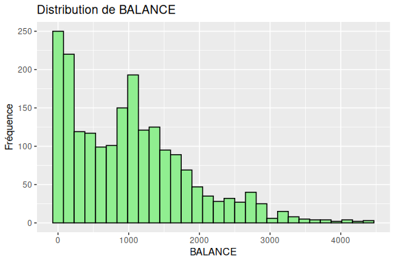
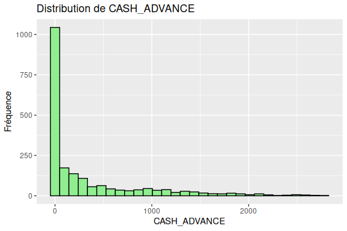
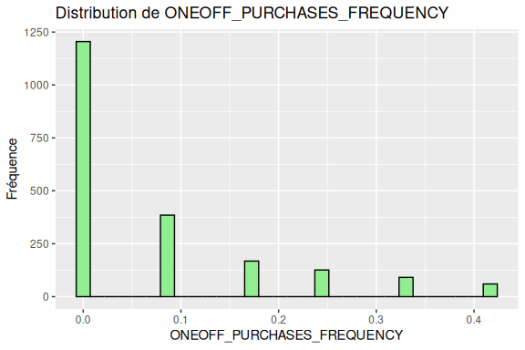
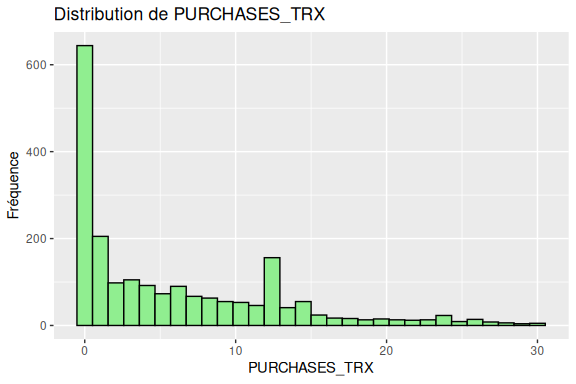
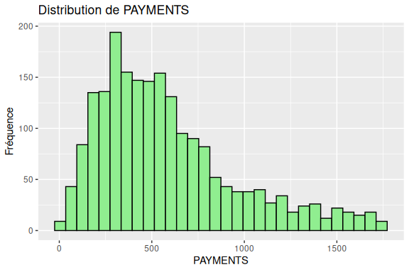
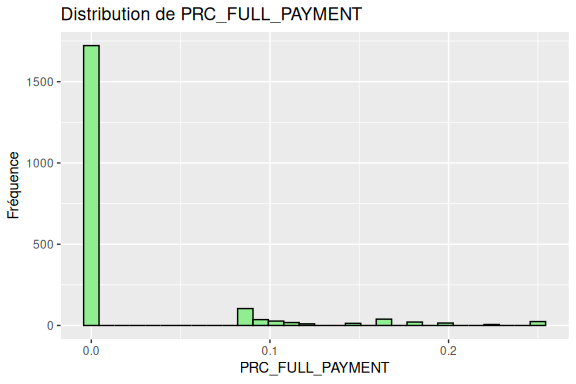
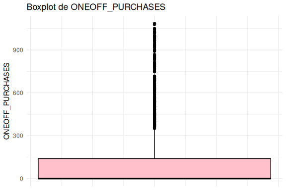
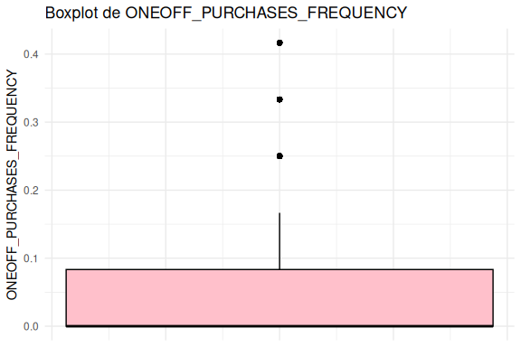
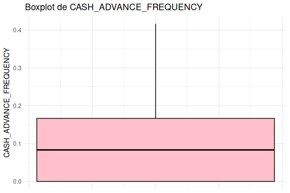
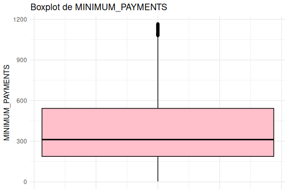

Analyse Exploratoire
================

``` r
# Moyenne
sapply(data, mean, na.rm = TRUE)
```

    ##                          BALANCE                BALANCE_FREQUENCY 
    ##                     1.024948e+03                     9.694885e-01 
    ##                        PURCHASES                 ONEOFF_PURCHASES 
    ##                     2.615234e+02                     1.175435e+02 
    ##           INSTALLMENTS_PURCHASES                     CASH_ADVANCE 
    ##                     1.441638e+02                     3.343629e+02 
    ##              PURCHASES_FREQUENCY       ONEOFF_PURCHASES_FREQUENCY 
    ##                     3.444717e-01                     7.219488e-02 
    ## PURCHASES_INSTALLMENTS_FREQUENCY           CASH_ADVANCE_FREQUENCY 
    ##                     2.779689e-01                     9.103191e-02 
    ##                 CASH_ADVANCE_TRX                    PURCHASES_TRX 
    ##                     1.491892e+00                     5.810811e+00 
    ##                     CREDIT_LIMIT                         PAYMENTS 
    ##                     2.579091e+03                     5.838450e+02 
    ##                 MINIMUM_PAYMENTS                 PRC_FULL_PAYMENT 
    ##                     3.936023e+02                     1.985161e-02 
    ##                           TENURE 
    ##                     1.200000e+01

``` r
# Médiane
sapply(data, median, na.rm = TRUE)
```

    ##                          BALANCE                BALANCE_FREQUENCY 
    ##                       955.184754                         1.000000 
    ##                        PURCHASES                 ONEOFF_PURCHASES 
    ##                       149.710000                         0.000000 
    ##           INSTALLMENTS_PURCHASES                     CASH_ADVANCE 
    ##                         0.000000                        37.483718 
    ##              PURCHASES_FREQUENCY       ONEOFF_PURCHASES_FREQUENCY 
    ##                         0.250000                         0.000000 
    ## PURCHASES_INSTALLMENTS_FREQUENCY           CASH_ADVANCE_FREQUENCY 
    ##                         0.000000                         0.083333 
    ##                 CASH_ADVANCE_TRX                    PURCHASES_TRX 
    ##                         1.000000                         3.000000 
    ##                     CREDIT_LIMIT                         PAYMENTS 
    ##                      2000.000000                       504.561160 
    ##                 MINIMUM_PAYMENTS                 PRC_FULL_PAYMENT 
    ##                       311.963409                         0.000000 
    ##                           TENURE 
    ##                        12.000000

``` r
# Mode (fonction personnalisée, car R n'a pas de mode intégré)
get_mode <- function(v) {
  uniqv <- unique(v)
  uniqv[which.max(tabulate(match(v, uniqv)))]
}
sapply(data, get_mode)
```

    ##                          BALANCE                BALANCE_FREQUENCY 
    ##                         40.90075                          1.00000 
    ##                        PURCHASES                 ONEOFF_PURCHASES 
    ##                          0.00000                          0.00000 
    ##           INSTALLMENTS_PURCHASES                     CASH_ADVANCE 
    ##                          0.00000                          0.00000 
    ##              PURCHASES_FREQUENCY       ONEOFF_PURCHASES_FREQUENCY 
    ##                          0.00000                          0.00000 
    ## PURCHASES_INSTALLMENTS_FREQUENCY           CASH_ADVANCE_FREQUENCY 
    ##                          0.00000                          0.00000 
    ##                 CASH_ADVANCE_TRX                    PURCHASES_TRX 
    ##                          0.00000                          0.00000 
    ##                     CREDIT_LIMIT                         PAYMENTS 
    ##                       1200.00000                        201.80208 
    ##                 MINIMUM_PAYMENTS                 PRC_FULL_PAYMENT 
    ##                        139.50979                          0.00000 
    ##                           TENURE 
    ##                         12.00000

``` r
# Écart-type
sapply(data, sd, na.rm = TRUE)
```

    ##                          BALANCE                BALANCE_FREQUENCY 
    ##                     8.447913e+02                     8.522890e-02 
    ##                        PURCHASES                 ONEOFF_PURCHASES 
    ##                     3.143626e+02                     2.204483e+02 
    ##           INSTALLMENTS_PURCHASES                     CASH_ADVANCE 
    ##                     2.162904e+02                     5.500022e+02 
    ##              PURCHASES_FREQUENCY       ONEOFF_PURCHASES_FREQUENCY 
    ##                     3.619499e-01                     1.111671e-01 
    ## PURCHASES_INSTALLMENTS_FREQUENCY           CASH_ADVANCE_FREQUENCY 
    ##                     3.655734e-01                     1.127375e-01 
    ##                 CASH_ADVANCE_TRX                    PURCHASES_TRX 
    ##                     1.924920e+00                     6.830659e+00 
    ##                     CREDIT_LIMIT                         PAYMENTS 
    ##                     1.707943e+03                     3.766651e+02 
    ##                 MINIMUM_PAYMENTS                 PRC_FULL_PAYMENT 
    ##                     2.615090e+02                     5.107206e-02 
    ##                           TENURE 
    ##                     0.000000e+00

``` r
# Variance
sapply(data, var, na.rm = TRUE)
```

    ##                          BALANCE                BALANCE_FREQUENCY 
    ##                     7.136723e+05                     7.263965e-03 
    ##                        PURCHASES                 ONEOFF_PURCHASES 
    ##                     9.882387e+04                     4.859745e+04 
    ##           INSTALLMENTS_PURCHASES                     CASH_ADVANCE 
    ##                     4.678154e+04                     3.025024e+05 
    ##              PURCHASES_FREQUENCY       ONEOFF_PURCHASES_FREQUENCY 
    ##                     1.310078e-01                     1.235812e-02 
    ## PURCHASES_INSTALLMENTS_FREQUENCY           CASH_ADVANCE_FREQUENCY 
    ##                     1.336439e-01                     1.270974e-02 
    ##                 CASH_ADVANCE_TRX                    PURCHASES_TRX 
    ##                     3.705318e+00                     4.665790e+01 
    ##                     CREDIT_LIMIT                         PAYMENTS 
    ##                     2.917069e+06                     1.418766e+05 
    ##                 MINIMUM_PAYMENTS                 PRC_FULL_PAYMENT 
    ##                     6.838695e+04                     2.608356e-03 
    ##                           TENURE 
    ##                     0.000000e+00

``` r
# Minimum
sapply(data, min, na.rm = TRUE)
```

    ##                          BALANCE                BALANCE_FREQUENCY 
    ##                         1.591980                         0.636364 
    ##                        PURCHASES                 ONEOFF_PURCHASES 
    ##                         0.000000                         0.000000 
    ##           INSTALLMENTS_PURCHASES                     CASH_ADVANCE 
    ##                         0.000000                         0.000000 
    ##              PURCHASES_FREQUENCY       ONEOFF_PURCHASES_FREQUENCY 
    ##                         0.000000                         0.000000 
    ## PURCHASES_INSTALLMENTS_FREQUENCY           CASH_ADVANCE_FREQUENCY 
    ##                         0.000000                         0.000000 
    ##                 CASH_ADVANCE_TRX                    PURCHASES_TRX 
    ##                         0.000000                         0.000000 
    ##                     CREDIT_LIMIT                         PAYMENTS 
    ##                       150.000000                         4.841543 
    ##                 MINIMUM_PAYMENTS                 PRC_FULL_PAYMENT 
    ##                         2.891346                         0.000000 
    ##                           TENURE 
    ##                        12.000000

``` r
# Maximum
sapply(data, max, na.rm = TRUE)
```

    ##                          BALANCE                BALANCE_FREQUENCY 
    ##                      4393.939007                         1.000000 
    ##                        PURCHASES                 ONEOFF_PURCHASES 
    ##                      1957.300000                      1085.630000 
    ##           INSTALLMENTS_PURCHASES                     CASH_ADVANCE 
    ##                      1043.180000                      2780.106659 
    ##              PURCHASES_FREQUENCY       ONEOFF_PURCHASES_FREQUENCY 
    ##                         1.000000                         0.416667 
    ## PURCHASES_INSTALLMENTS_FREQUENCY           CASH_ADVANCE_FREQUENCY 
    ##                         1.000000                         0.416667 
    ##                 CASH_ADVANCE_TRX                    PURCHASES_TRX 
    ##                         7.000000                        30.000000 
    ##                     CREDIT_LIMIT                         PAYMENTS 
    ##                      7600.000000                      1741.996361 
    ##                 MINIMUM_PAYMENTS                 PRC_FULL_PAYMENT 
    ##                      1167.316335                         0.250000 
    ##                           TENURE 
    ##                        12.000000

``` r
# Quartiles (25%, 50%, 75%)
sapply(data, function(x) quantile(x, probs = c(0.25, 0.5, 0.75), na.rm = TRUE))
```

    ##       BALANCE BALANCE_FREQUENCY PURCHASES ONEOFF_PURCHASES
    ## 25%  274.9226                 1      0.00             0.00
    ## 50%  955.1848                 1    149.71             0.00
    ## 75% 1472.5915                 1    420.96           139.85
    ##     INSTALLMENTS_PURCHASES CASH_ADVANCE PURCHASES_FREQUENCY
    ## 25%                  0.000      0.00000               0.000
    ## 50%                  0.000     37.48372               0.250
    ## 75%                238.085    436.31512               0.625
    ##     ONEOFF_PURCHASES_FREQUENCY PURCHASES_INSTALLMENTS_FREQUENCY
    ## 25%                   0.000000                              0.0
    ## 50%                   0.000000                              0.0
    ## 75%                   0.083333                              0.5
    ##     CASH_ADVANCE_FREQUENCY CASH_ADVANCE_TRX PURCHASES_TRX CREDIT_LIMIT PAYMENTS
    ## 25%               0.000000                0             0         1200 302.1927
    ## 50%               0.083333                1             3         2000 504.5612
    ## 75%               0.166667                3            10         3000 762.9291
    ##     MINIMUM_PAYMENTS PRC_FULL_PAYMENT TENURE
    ## 25%         187.6265                0     12
    ## 50%         311.9634                0     12
    ## 75%         542.5740                0     12

``` r
# Percentiles (exemple : 10%, 90%)
sapply(data, function(x) quantile(x, probs = c(0.1, 0.9), na.rm = TRUE))
```

    ##        BALANCE BALANCE_FREQUENCY PURCHASES ONEOFF_PURCHASES
    ## 10%   58.89497          0.818182     0.000            0.000
    ## 90% 2218.14108          1.000000   702.028          415.236
    ##     INSTALLMENTS_PURCHASES CASH_ADVANCE PURCHASES_FREQUENCY
    ## 10%                   0.00        0.000                   0
    ## 90%                 472.84     1153.266                   1
    ##     ONEOFF_PURCHASES_FREQUENCY PURCHASES_INSTALLMENTS_FREQUENCY
    ## 10%                       0.00                                0
    ## 90%                       0.25                                1
    ##     CASH_ADVANCE_FREQUENCY CASH_ADVANCE_TRX PURCHASES_TRX CREDIT_LIMIT
    ## 10%                   0.00                0             0         1000
    ## 90%                   0.25                5            15         5000
    ##      PAYMENTS MINIMUM_PAYMENTS PRC_FULL_PAYMENT TENURE
    ## 10%  187.2024         139.8612         0.000000     12
    ## 90% 1143.3087         800.7793         0.090909     12

``` r
# Vérifier que num_cols n'est pas vide
if (length(num_cols) > 0) {
  # Calculer moyenne et écart-type
  stats <- data.frame(
    variable = num_cols,
    mean = sapply(data[, num_cols], mean, na.rm = TRUE),
    sd = sapply(data[, num_cols], sd, na.rm = TRUE),
    stringsAsFactors = FALSE
  )
  
  # Barplot avec erreur ± écart-type
  print(ggplot(stats, aes(x = reorder(variable, mean), y = mean)) +
    geom_bar(stat="identity", fill="skyblue") +
    geom_errorbar(aes(ymin = mean - sd, ymax = mean + sd), width = 0.4) +
    theme(axis.text.x = element_text(angle = 45, hjust = 1)) +
    labs(title="Moyenne ± Écart-type des variables", y="Valeur", x="Variable"))
} else {
  print("Erreur: Aucune colonne trouvée dans les données")
}
```

<!-- -->

``` r
for (col in num_cols) {
  p <- ggplot(data, aes_string(x = col)) +
    geom_histogram(fill="lightgreen", color="black", bins=30) +
    labs(title=paste("Distribution de", col), x=col, y="Fréquence")
  print(p)
}
```

    ## Warning: `aes_string()` was deprecated in ggplot2 3.0.0.
    ## ℹ Please use tidy evaluation idioms with `aes()`.
    ## ℹ See also `vignette("ggplot2-in-packages")` for more information.
    ## This warning is displayed once per session.
    ## Call `lifecycle::last_lifecycle_warnings()` to see where this warning was generated.

<!-- --><!-- --><!-- --><!-- --><!-- --><!-- --><!-- --><!-- --><!-- --><!-- --><!-- --><!-- --><!-- --><!-- --><!-- --><!-- --><!-- -->

``` r
# Boxplot pour chaque variable
for (col in num_cols) {
  p <- ggplot(data, aes(y = .data[[col]])) +
    geom_boxplot(fill="pink", color="black") +
    labs(title=paste("Boxplot de", col), y=col) +
    theme_minimal() +
    theme(axis.text.x = element_blank(),
          axis.ticks.x = element_blank())
  print(p)
}
```

<!-- --><!-- --><!-- --><!-- --><!-- --><!-- --><!-- --><!-- --><!-- --><!-- --><!-- --><!-- --><!-- --><!-- --><!-- --><!-- --><!-- -->
