Analyse Exploratoire
================

- [Outliers (IQR) – BALANCE](#outliers-iqr--balance)
- [Visualisation Graphique des
  Outliers](#visualisation-graphique-des-outliers)
- [Matrice de corrélation des
  outliers](#matrice-de-corrélation-des-outliers)

``` r
# Fonction pour le mode
get_mode <- function(v) {
  uniqv <- unique(v)
  uniqv[which.max(tabulate(match(v, uniqv)))]
}

# Calcul des statistiques complètes pour toutes les colonnes numériques
stats_completes <- data.frame(
  Variable = num_cols,
  Moyenne = sapply(data[, num_cols], mean, na.rm = TRUE),
  Mediane = sapply(data[, num_cols], median, na.rm = TRUE),
  Mode = sapply(data[, num_cols], get_mode),
  Ecart_type = sapply(data[, num_cols], sd, na.rm = TRUE),
  Variance = sapply(data[, num_cols], var, na.rm = TRUE),
  Min = sapply(data[, num_cols], min, na.rm = TRUE),
  Max = sapply(data[, num_cols], max, na.rm = TRUE),
  Skewness = sapply(data[, num_cols], function(x) skewness(x, na.rm = TRUE)),
  stringsAsFactors = FALSE
)

# Ajouter une colonne pour l'interprétation de l'asymétrie
stats_completes$Asymetrie <- ifelse(
  stats_completes$Skewness > 0, "Droite",
  ifelse(stats_completes$Skewness < 0, "Gauche", "Symétrique")
)

# Afficher le tableau
print(stats_completes)
```

    ##                                                          Variable      Moyenne
    ## BALANCE                                                   BALANCE 1.024948e+03
    ## BALANCE_FREQUENCY                               BALANCE_FREQUENCY 9.694885e-01
    ## PURCHASES                                               PURCHASES 2.615234e+02
    ## ONEOFF_PURCHASES                                 ONEOFF_PURCHASES 1.175435e+02
    ## INSTALLMENTS_PURCHASES                     INSTALLMENTS_PURCHASES 1.441638e+02
    ## CASH_ADVANCE                                         CASH_ADVANCE 3.343629e+02
    ## PURCHASES_FREQUENCY                           PURCHASES_FREQUENCY 3.444717e-01
    ## ONEOFF_PURCHASES_FREQUENCY             ONEOFF_PURCHASES_FREQUENCY 7.219488e-02
    ## PURCHASES_INSTALLMENTS_FREQUENCY PURCHASES_INSTALLMENTS_FREQUENCY 2.779689e-01
    ## CASH_ADVANCE_FREQUENCY                     CASH_ADVANCE_FREQUENCY 9.103191e-02
    ## CASH_ADVANCE_TRX                                 CASH_ADVANCE_TRX 1.491892e+00
    ## PURCHASES_TRX                                       PURCHASES_TRX 5.810811e+00
    ## CREDIT_LIMIT                                         CREDIT_LIMIT 2.579091e+03
    ## PAYMENTS                                                 PAYMENTS 5.838450e+02
    ## MINIMUM_PAYMENTS                                 MINIMUM_PAYMENTS 3.936023e+02
    ## PRC_FULL_PAYMENT                                 PRC_FULL_PAYMENT 1.985161e-02
    ##                                      Mediane       Mode   Ecart_type
    ## BALANCE                           955.184754   40.90075 8.447913e+02
    ## BALANCE_FREQUENCY                   1.000000    1.00000 8.522890e-02
    ## PURCHASES                         149.710000    0.00000 3.143626e+02
    ## ONEOFF_PURCHASES                    0.000000    0.00000 2.204483e+02
    ## INSTALLMENTS_PURCHASES              0.000000    0.00000 2.162904e+02
    ## CASH_ADVANCE                       37.483718    0.00000 5.500022e+02
    ## PURCHASES_FREQUENCY                 0.250000    0.00000 3.619499e-01
    ## ONEOFF_PURCHASES_FREQUENCY          0.000000    0.00000 1.111671e-01
    ## PURCHASES_INSTALLMENTS_FREQUENCY    0.000000    0.00000 3.655734e-01
    ## CASH_ADVANCE_FREQUENCY              0.083333    0.00000 1.127375e-01
    ## CASH_ADVANCE_TRX                    1.000000    0.00000 1.924920e+00
    ## PURCHASES_TRX                       3.000000    0.00000 6.830659e+00
    ## CREDIT_LIMIT                     2000.000000 1200.00000 1.707943e+03
    ## PAYMENTS                          504.561160  201.80208 3.766651e+02
    ## MINIMUM_PAYMENTS                  311.963409  139.50979 2.615090e+02
    ## PRC_FULL_PAYMENT                    0.000000    0.00000 5.107206e-02
    ##                                      Variance        Min         Max   Skewness
    ## BALANCE                          7.136723e+05   1.591980 4393.939007  0.9357178
    ## BALANCE_FREQUENCY                7.263965e-03   0.636364    1.000000 -2.8445510
    ## PURCHASES                        9.882387e+04   0.000000 1957.300000  1.5271482
    ## ONEOFF_PURCHASES                 4.859745e+04   0.000000 1085.630000  2.3344945
    ## INSTALLMENTS_PURCHASES           4.678154e+04   0.000000 1043.180000  1.6705844
    ## CASH_ADVANCE                     3.025024e+05   0.000000 2780.106659  1.9733548
    ## PURCHASES_FREQUENCY              1.310078e-01   0.000000    1.000000  0.6948368
    ## ONEOFF_PURCHASES_FREQUENCY       1.235812e-02   0.000000    0.416667  1.5988998
    ## PURCHASES_INSTALLMENTS_FREQUENCY 1.336439e-01   0.000000    1.000000  0.9527922
    ## CASH_ADVANCE_FREQUENCY           1.270974e-02   0.000000    0.416667  1.1313912
    ## CASH_ADVANCE_TRX                 3.705318e+00   0.000000    7.000000  1.1937841
    ## PURCHASES_TRX                    4.665790e+01   0.000000   30.000000  1.2884580
    ## CREDIT_LIMIT                     2.917069e+06 150.000000 7600.000000  1.2276632
    ## PAYMENTS                         1.418766e+05   4.841543 1741.996361  1.0512807
    ## MINIMUM_PAYMENTS                 6.838695e+04   2.891346 1167.316335  1.0030370
    ## PRC_FULL_PAYMENT                 2.608356e-03   0.000000    0.250000  2.7005481
    ##                                  Asymetrie
    ## BALANCE                             Droite
    ## BALANCE_FREQUENCY                   Gauche
    ## PURCHASES                           Droite
    ## ONEOFF_PURCHASES                    Droite
    ## INSTALLMENTS_PURCHASES              Droite
    ## CASH_ADVANCE                        Droite
    ## PURCHASES_FREQUENCY                 Droite
    ## ONEOFF_PURCHASES_FREQUENCY          Droite
    ## PURCHASES_INSTALLMENTS_FREQUENCY    Droite
    ## CASH_ADVANCE_FREQUENCY              Droite
    ## CASH_ADVANCE_TRX                    Droite
    ## PURCHASES_TRX                       Droite
    ## CREDIT_LIMIT                        Droite
    ## PAYMENTS                            Droite
    ## MINIMUM_PAYMENTS                    Droite
    ## PRC_FULL_PAYMENT                    Droite

``` r
# Quartiles (25%, 50%, 75%)
sapply(data[, num_cols], function(x) quantile(x, probs = c(0.25, 0.5, 0.75), na.rm = TRUE))
```

    ##       BALANCE BALANCE_FREQUENCY PURCHASES ONEOFF_PURCHASES
    ## 25%  274.9226                 1      0.00             0.00
    ## 50%  955.1848                 1    149.71             0.00
    ## 75% 1472.5915                 1    420.96           139.85
    ##     INSTALLMENTS_PURCHASES CASH_ADVANCE PURCHASES_FREQUENCY
    ## 25%                  0.000      0.00000               0.000
    ## 50%                  0.000     37.48372               0.250
    ## 75%                238.085    436.31512               0.625
    ##     ONEOFF_PURCHASES_FREQUENCY PURCHASES_INSTALLMENTS_FREQUENCY
    ## 25%                   0.000000                              0.0
    ## 50%                   0.000000                              0.0
    ## 75%                   0.083333                              0.5
    ##     CASH_ADVANCE_FREQUENCY CASH_ADVANCE_TRX PURCHASES_TRX CREDIT_LIMIT PAYMENTS
    ## 25%               0.000000                0             0         1200 302.1927
    ## 50%               0.083333                1             3         2000 504.5612
    ## 75%               0.166667                3            10         3000 762.9291
    ##     MINIMUM_PAYMENTS PRC_FULL_PAYMENT
    ## 25%         187.6265                0
    ## 50%         311.9634                0
    ## 75%         542.5740                0

``` r
# Percentiles (exemple : 10%, 90%)
sapply(data[, num_cols], function(x) quantile(x, probs = c(0.1, 0.9), na.rm = TRUE))
```

    ##        BALANCE BALANCE_FREQUENCY PURCHASES ONEOFF_PURCHASES
    ## 10%   58.89497          0.818182     0.000            0.000
    ## 90% 2218.14108          1.000000   702.028          415.236
    ##     INSTALLMENTS_PURCHASES CASH_ADVANCE PURCHASES_FREQUENCY
    ## 10%                   0.00        0.000                   0
    ## 90%                 472.84     1153.266                   1
    ##     ONEOFF_PURCHASES_FREQUENCY PURCHASES_INSTALLMENTS_FREQUENCY
    ## 10%                       0.00                                0
    ## 90%                       0.25                                1
    ##     CASH_ADVANCE_FREQUENCY CASH_ADVANCE_TRX PURCHASES_TRX CREDIT_LIMIT
    ## 10%                   0.00                0             0         1000
    ## 90%                   0.25                5            15         5000
    ##      PAYMENTS MINIMUM_PAYMENTS PRC_FULL_PAYMENT
    ## 10%  187.2024         139.8612         0.000000
    ## 90% 1143.3087         800.7793         0.090909

``` r
# Vérifier que num_cols n'est pas vide
if (length(num_cols) > 0) {
  # Calculer moyenne et écart-type
  stats <- data.frame(
    variable = num_cols,
    mean = sapply(data[, num_cols], mean, na.rm = TRUE),
    sd = sapply(data[, num_cols], sd, na.rm = TRUE),
    stringsAsFactors = FALSE
  )
  
  # Barplot avec erreur ± écart-type
  print(ggplot(stats, aes(x = reorder(variable, mean), y = mean)) +
    geom_bar(stat="identity", fill="skyblue") +
    geom_errorbar(aes(ymin = mean - sd, ymax = mean + sd), width = 0.4) +
    theme(axis.text.x = element_text(angle = 45, hjust = 1)) +
    labs(title="Moyenne ± Écart-type des variables", y="Valeur", x="Variable"))
} else {
  print("Erreur: Aucune colonne trouvée dans les données")
}
```

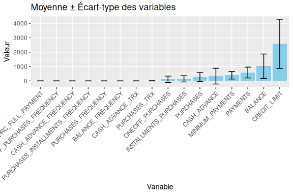<!-- -->

``` r
for (col in num_cols) {
  p <- ggplot(data, aes(x = .data[[col]])) +
    geom_histogram(fill="lightgreen", color="black", bins=30) +
    labs(title=paste("Distribution de", col), x=col, y="Fréquence")
  print(p)
}
```

<!-- --><!-- --><!-- --><!-- --><!-- --><!-- -->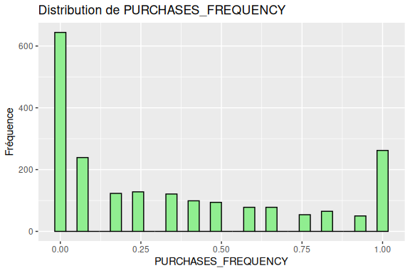<!-- --><!-- --><!-- --><!-- --><!-- --><!-- -->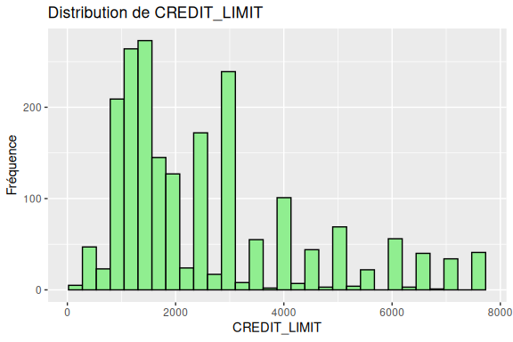<!-- --><!-- --><!-- --><!-- -->

``` r
# Boxplot pour chaque variable
for (col in num_cols) {
  p <- ggplot(data, aes(y = .data[[col]])) +
    geom_boxplot(fill="pink", color="black") +
    labs(title=paste("Boxplot de", col), y=col) +
    theme_minimal() +
    theme(axis.text.x = element_blank(),
          axis.ticks.x = element_blank())
  print(p)
}
```

<!-- --><!-- --><!-- --><!-- --><!-- --><!-- --><!-- --><!-- --><!-- --><!-- --><!-- --><!-- --><!-- --><!-- --><!-- --><!-- -->

## Outliers (IQR) – BALANCE

``` r
# Détection des outliers via IQR pour BALANCE
Q1 <- quantile(data$BALANCE, 0.25, na.rm = TRUE)
Q3 <- quantile(data$BALANCE, 0.75, na.rm = TRUE)
IQR <- Q3 - Q1
lower <- Q1 - 1.5 * IQR
upper <- Q3 + 1.5 * IQR

outliers_balance <- subset(data, BALANCE < lower | BALANCE > upper)

# Récapitulatif clair (seuils et compte)
summary_outliers <- data.frame(
  variable = "BALANCE",
  lower = lower,
  upper = upper,
  n_outliers = nrow(outliers_balance)
)
print(summary_outliers)
```

    ##     variable     lower    upper n_outliers
    ## 25%  BALANCE -1521.581 3269.095         32

``` r
# Top 10 outliers (colonnes clés uniquement)
if (nrow(outliers_balance) > 0) {
  key_cols <- intersect(c("BALANCE","CREDIT_LIMIT","PAYMENTS","PURCHASES","CASH_ADVANCE","PRC_FULL_PAYMENT"), names(outliers_balance))
  outliers_view <- outliers_balance[order(outliers_balance$BALANCE, decreasing = TRUE), key_cols, drop = FALSE]
  print(utils::head(outliers_view, 10))
} else {
  print("Aucun outlier détecté pour BALANCE selon la règle IQR.")
}
```

    ##       BALANCE CREDIT_LIMIT PAYMENTS PURCHASES CASH_ADVANCE PRC_FULL_PAYMENT
    ## 618  4393.939         5300 1026.406    417.08    2126.9616                0
    ## 1302 4383.572         5000 1161.701      0.00    1805.8535                0
    ## 1049 4355.982         7500 1188.603      0.00     305.9856                0
    ## 25   4245.855         5000 1004.355   1957.30       0.0000                0
    ## 933  4187.551         4500 1216.465      0.00     433.7192                0
    ## 1070 4128.312         5000 1082.274      0.00    1674.4016                0
    ## 1665 4071.994         5000 1528.928      0.00    1541.3938                0
    ## 19   4037.306         4500 1073.845     45.00     104.2381                0
    ## 972  4035.138         7000 1474.388      0.00    2399.4370                0
    ## 767  3985.638         6000 1203.181     20.00    1306.1840                0

## Visualisation Graphique des Outliers

``` r
# 1. Boxplot avec identification des outliers pour BALANCE
ggplot(data, aes(y = BALANCE)) +
  geom_boxplot(fill = "lightblue", outlier.colour = "red", outlier.size = 2) +
  labs(title = "Outliers de BALANCE (en rouge)", 
       y = "Balance") +
  theme_minimal() +
  theme(axis.text.x = element_blank(),
        axis.ticks.x = element_blank())
```

<!-- -->

``` r
# 2. Boxplots multiples pour toutes les variables numériques
if (length(num_cols) > 0) {
  # Normaliser les données pour comparaison
  data_norm <- as.data.frame(scale(data[, num_cols]))
  data_norm$ID <- 1:nrow(data_norm)
  
  # Transformer en format long pour ggplot
  data_long <- melt(data_norm, id.vars = "ID", variable.name = "Variable", value.name = "Value")
  
  ggplot(data_long, aes(x = Variable, y = Value)) +
    geom_boxplot(fill = "lightgreen", outlier.colour = "red", outlier.size = 1.5) +
    labs(title = "Outliers de toutes les variables (données normalisées)", 
         x = "Variables", 
         y = "Valeur normalisée") +
    theme_minimal() +
    theme(axis.text.x = element_text(angle = 45, hjust = 1))
}
```

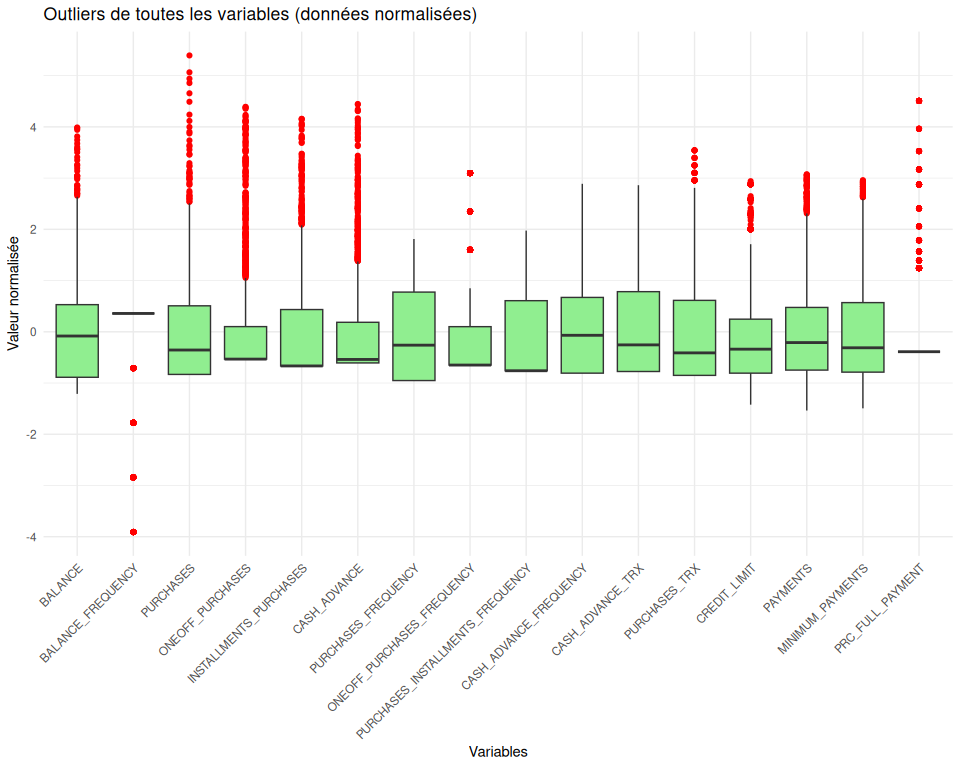<!-- -->

``` r
# 3. Scatter plot avec identification des outliers pour BALANCE vs CREDIT_LIMIT
if ("CREDIT_LIMIT" %in% names(data)) {
  data$is_outlier_balance <- ifelse(data$BALANCE < lower | data$BALANCE > upper, "Outlier", "Normal")
  
  ggplot(data, aes(x = CREDIT_LIMIT, y = BALANCE, color = is_outlier_balance)) +
    geom_point(alpha = 0.5, size = 2) +
    scale_color_manual(values = c("Normal" = "blue", "Outlier" = "red")) +
    labs(title = "Outliers de BALANCE en fonction de CREDIT_LIMIT", 
         x = "Credit Limit", 
         y = "Balance",
         color = "Type") +
    theme_minimal()
}
```

<!-- -->

``` r
# 4. Density plot avec zones d'outliers
ggplot(data, aes(x = BALANCE)) +
  geom_density(fill = "lightblue", alpha = 0.5) +
  geom_vline(xintercept = lower, color = "red", linetype = "dashed", linewidth = 1) +
  geom_vline(xintercept = upper, color = "red", linetype = "dashed", linewidth = 1) +
  annotate("text", x = lower, y = 0, label = paste("Q1-1.5*IQR:", round(lower, 2)), 
           hjust = 1.1, color = "red") +
  annotate("text", x = upper, y = 0, label = paste("Q3+1.5*IQR:", round(upper, 2)), 
           hjust = -0.1, color = "red") +
  labs(title = "Distribution de BALANCE avec limites d'outliers", 
       x = "Balance", 
       y = "Densité") +
  theme_minimal()
```

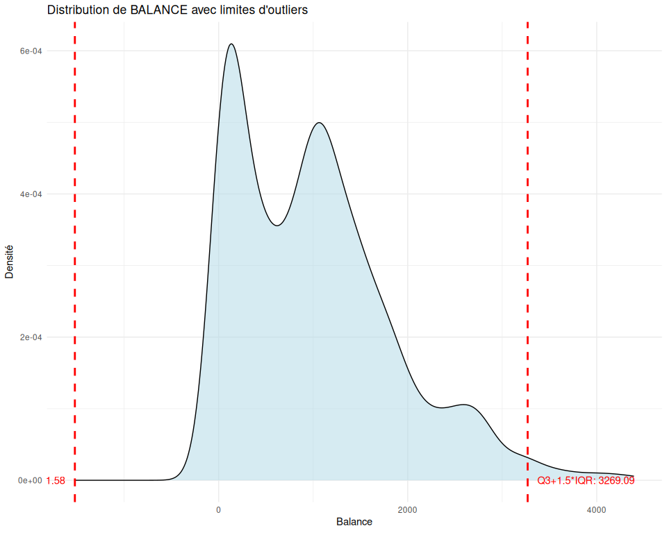<!-- -->

``` r
# 5. Détection et visualisation des outliers pour toutes les variables
outliers_summary <- data.frame()

for (col in num_cols) {
  Q1 <- quantile(data[[col]], 0.25, na.rm = TRUE)
  Q3 <- quantile(data[[col]], 0.75, na.rm = TRUE)
  IQR_val <- Q3 - Q1
  lower_bound <- Q1 - 1.5 * IQR_val
  upper_bound <- Q3 + 1.5 * IQR_val
  
  n_outliers <- sum(data[[col]] < lower_bound | data[[col]] > upper_bound, na.rm = TRUE)
  pct_outliers <- round(100 * n_outliers / nrow(data), 2)
  
  outliers_summary <- rbind(outliers_summary, data.frame(
    Variable = col,
    Q1 = Q1,
    Q3 = Q3,
    IQR = IQR_val,
    Lower = lower_bound,
    Upper = upper_bound,
    N_Outliers = n_outliers,
    Pct_Outliers = pct_outliers
  ))
}

# Afficher le tableau récapitulatif
print(outliers_summary)
```

    ##                               Variable        Q1          Q3         IQR
    ## 25%                            BALANCE  274.9226 1472.591481 1197.668854
    ## 25%1                 BALANCE_FREQUENCY    1.0000    1.000000    0.000000
    ## 25%2                         PURCHASES    0.0000  420.960000  420.960000
    ## 25%3                  ONEOFF_PURCHASES    0.0000  139.850000  139.850000
    ## 25%4            INSTALLMENTS_PURCHASES    0.0000  238.085000  238.085000
    ## 25%5                      CASH_ADVANCE    0.0000  436.315122  436.315122
    ## 25%6               PURCHASES_FREQUENCY    0.0000    0.625000    0.625000
    ## 25%7        ONEOFF_PURCHASES_FREQUENCY    0.0000    0.083333    0.083333
    ## 25%8  PURCHASES_INSTALLMENTS_FREQUENCY    0.0000    0.500000    0.500000
    ## 25%9            CASH_ADVANCE_FREQUENCY    0.0000    0.166667    0.166667
    ## 25%10                 CASH_ADVANCE_TRX    0.0000    3.000000    3.000000
    ## 25%11                    PURCHASES_TRX    0.0000   10.000000   10.000000
    ## 25%12                     CREDIT_LIMIT 1200.0000 3000.000000 1800.000000
    ## 25%13                         PAYMENTS  302.1927  762.929061  460.736406
    ## 25%14                 MINIMUM_PAYMENTS  187.6265  542.573998  354.947543
    ## 25%15                 PRC_FULL_PAYMENT    0.0000    0.000000    0.000000
    ##               Lower        Upper N_Outliers Pct_Outliers
    ## 25%   -1521.5806553 3269.0947627         32         1.57
    ## 25%1      1.0000000    1.0000000        278        13.66
    ## 25%2   -631.4400000 1052.4000000         44         2.16
    ## 25%3   -209.7750000  349.6250000        245        12.04
    ## 25%4   -357.1275000  595.2125000        112         5.50
    ## 25%5   -654.4726837 1090.7878062        233        11.45
    ## 25%6     -0.9375000    1.5625000          0         0.00
    ## 25%7     -0.1249995    0.2083325        277        13.61
    ## 25%8     -0.7500000    1.2500000          0         0.00
    ## 25%9     -0.2500005    0.4166675          0         0.00
    ## 25%10    -4.5000000    7.5000000          0         0.00
    ## 25%11   -15.0000000   25.0000000         37         1.82
    ## 25%12 -1500.0000000 5700.0000000        175         8.60
    ## 25%13  -388.9119540 1454.0336700         85         4.18
    ## 25%14  -344.7948600 1074.9953120         36         1.77
    ## 25%15     0.0000000    0.0000000        313        15.38

``` r
# Graphique à barres du pourcentage d'outliers par variable
ggplot(outliers_summary, aes(x = reorder(Variable, -Pct_Outliers), y = Pct_Outliers)) +
  geom_bar(stat = "identity", fill = "coral") +
  geom_text(aes(label = paste0(Pct_Outliers, "%")), vjust = -0.5, size = 3) +
  labs(title = "Pourcentage d'outliers par variable", 
       x = "Variable", 
       y = "% d'outliers") +
  theme_minimal() +
  theme(axis.text.x = element_text(angle = 45, hjust = 1))
```

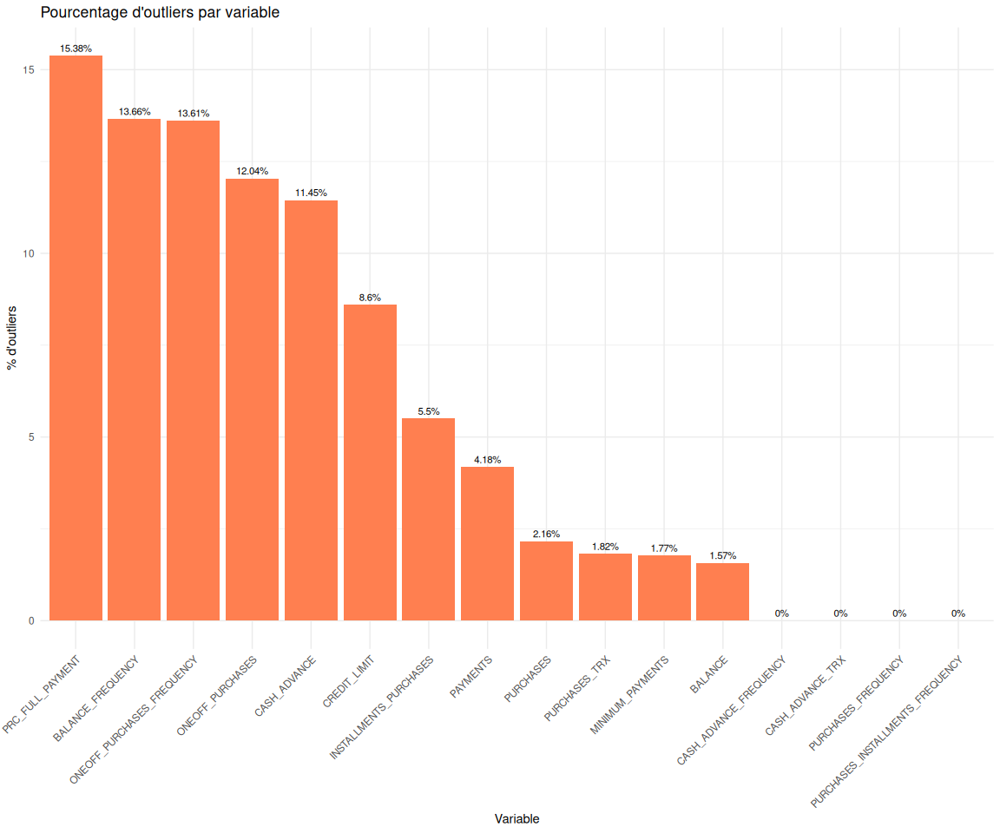<!-- -->
\## Détection détaillée des outliers pour chaque variable

``` r
# Pour chaque variable numérique, créer des visualisations détaillées
for (col in num_cols) {
  cat("\n### Variable:", col, "\n\n")
  
  # Calcul des seuils IQR
  Q1 <- quantile(data[[col]], 0.25, na.rm = TRUE)
  Q3 <- quantile(data[[col]], 0.75, na.rm = TRUE)
  IQR_val <- Q3 - Q1
  lower_bound <- Q1 - 1.5 * IQR_val
  upper_bound <- Q3 + 1.5 * IQR_val
  
  # Identification des outliers
  outliers_mask <- data[[col]] < lower_bound | data[[col]] > upper_bound
  n_outliers <- sum(outliers_mask, na.rm = TRUE)
  pct_outliers <- round(100 * n_outliers / nrow(data), 2)
  
  # Afficher les statistiques
  cat("- Nombre d'outliers:", n_outliers, "/", nrow(data), "(", pct_outliers, "%)\n")
  cat("- Limites: [", round(lower_bound, 2), ",", round(upper_bound, 2), "]\n")
  cat("- Q1 =", round(Q1, 2), ", Q3 =", round(Q3, 2), ", IQR =", round(IQR_val, 2), "\n\n")
  
  # Créer une colonne pour identifier les outliers
  data$outlier_status <- ifelse(outliers_mask, "Outlier", "Normal")
  
  # 1. Boxplot individuel avec outliers en rouge
  p1 <- ggplot(data, aes(y = .data[[col]])) +
    geom_boxplot(fill = "lightblue", outlier.colour = "red", outlier.size = 2) +
    labs(title = paste("Boxplot de", col), 
         y = col) +
    theme_minimal() +
    theme(axis.text.x = element_blank(),
          axis.ticks.x = element_blank())
  print(p1)
  
  # 2. Density plot avec zones d'outliers
  p2 <- ggplot(data, aes(x = .data[[col]])) +
    geom_density(fill = "lightgreen", alpha = 0.5) +
    geom_vline(xintercept = lower_bound, color = "red", linetype = "dashed", linewidth = 1) +
    geom_vline(xintercept = upper_bound, color = "red", linetype = "dashed", linewidth = 1) +
    geom_vline(xintercept = Q1, color = "blue", linetype = "dotted", linewidth = 0.8) +
    geom_vline(xintercept = Q3, color = "blue", linetype = "dotted", linewidth = 0.8) +
    labs(title = paste("Distribution de", col, "avec limites d'outliers"), 
         x = col, 
         y = "Densité") +
    theme_minimal()
  print(p2)
  
  # 3. Scatter plot avec index pour voir la position des outliers
  p3 <- ggplot(data, aes(x = 1:nrow(data), y = .data[[col]], color = outlier_status)) +
    geom_point(alpha = 0.6, size = 1.5) +
    scale_color_manual(values = c("Normal" = "blue", "Outlier" = "red")) +
    labs(title = paste("Outliers de", col, "par observation"), 
         x = "Index", 
         y = col,
         color = "Type") +
    theme_minimal()
  print(p3)
  
  # Afficher quelques exemples d'outliers si présents
  if (n_outliers > 0 & n_outliers <= 20) {
    cat("\nTous les outliers détectés:\n")
    outliers_data <- data[outliers_mask, c(col), drop = FALSE]
    print(outliers_data[order(outliers_data[[col]], decreasing = TRUE), , drop = FALSE])
  } else if (n_outliers > 20) {
    cat("\nTop 10 outliers (valeurs les plus extrêmes):\n")
    outliers_data <- data[outliers_mask, c(col), drop = FALSE]
    print(utils::head(outliers_data[order(abs(outliers_data[[col]] - median(data[[col]], na.rm = TRUE)), decreasing = TRUE), , drop = FALSE], 10))
  }
  
  cat("\n---\n")
}
```

    ## 
    ## ### Variable: BALANCE 
    ## 
    ## - Nombre d'outliers: 32 / 2035 ( 1.57 %)
    ## - Limites: [ -1521.58 , 3269.09 ]
    ## - Q1 = 274.92 , Q3 = 1472.59 , IQR = 1197.67

<!-- --><!-- --><!-- -->

    ## 
    ## Top 10 outliers (valeurs les plus extrêmes):
    ##       BALANCE
    ## 618  4393.939
    ## 1302 4383.572
    ## 1049 4355.982
    ## 25   4245.855
    ## 933  4187.551
    ## 1070 4128.312
    ## 1665 4071.994
    ## 19   4037.306
    ## 972  4035.138
    ## 767  3985.638
    ## 
    ## ---
    ## 
    ## ### Variable: BALANCE_FREQUENCY 
    ## 
    ## - Nombre d'outliers: 278 / 2035 ( 13.66 %)
    ## - Limites: [ 1 , 1 ]
    ## - Q1 = 1 , Q3 = 1 , IQR = 0

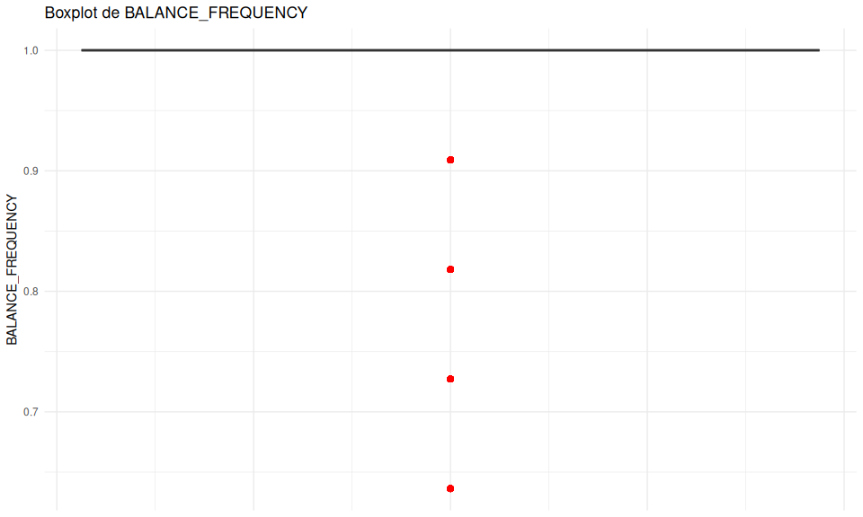<!-- --><!-- --><!-- -->

    ## 
    ## Top 10 outliers (valeurs les plus extrêmes):
    ##     BALANCE_FREQUENCY
    ## 26           0.636364
    ## 94           0.636364
    ## 186          0.636364
    ## 221          0.636364
    ## 238          0.636364
    ## 311          0.636364
    ## 340          0.636364
    ## 376          0.636364
    ## 397          0.636364
    ## 398          0.636364
    ## 
    ## ---
    ## 
    ## ### Variable: PURCHASES 
    ## 
    ## - Nombre d'outliers: 44 / 2035 ( 2.16 %)
    ## - Limites: [ -631.44 , 1052.4 ]
    ## - Q1 = 0 , Q3 = 420.96 , IQR = 420.96

<!-- --><!-- --><!-- -->

    ## 
    ## Top 10 outliers (valeurs les plus extrêmes):
    ##      PURCHASES
    ## 25     1957.30
    ## 1383   1853.70
    ## 1636   1814.65
    ## 288    1788.10
    ## 595    1725.05
    ## 444    1672.99
    ## 170    1594.00
    ## 160    1555.66
    ## 540    1518.26
    ## 124    1488.80
    ## 
    ## ---
    ## 
    ## ### Variable: ONEOFF_PURCHASES 
    ## 
    ## - Nombre d'outliers: 245 / 2035 ( 12.04 %)
    ## - Limites: [ -209.77 , 349.62 ]
    ## - Q1 = 0 , Q3 = 139.85 , IQR = 139.85

<!-- --><!-- --><!-- -->

    ## 
    ## Top 10 outliers (valeurs les plus extrêmes):
    ##      ONEOFF_PURCHASES
    ## 239           1085.63
    ## 170           1084.00
    ## 1094          1081.00
    ## 25            1077.30
    ## 640           1050.76
    ## 906           1045.84
    ## 365           1040.99
    ## 1046          1029.29
    ## 31            1025.00
    ## 540           1024.83
    ## 
    ## ---
    ## 
    ## ### Variable: INSTALLMENTS_PURCHASES 
    ## 
    ## - Nombre d'outliers: 112 / 2035 ( 5.5 %)
    ## - Limites: [ -357.13 , 595.21 ]
    ## - Q1 = 0 , Q3 = 238.08 , IQR = 238.08

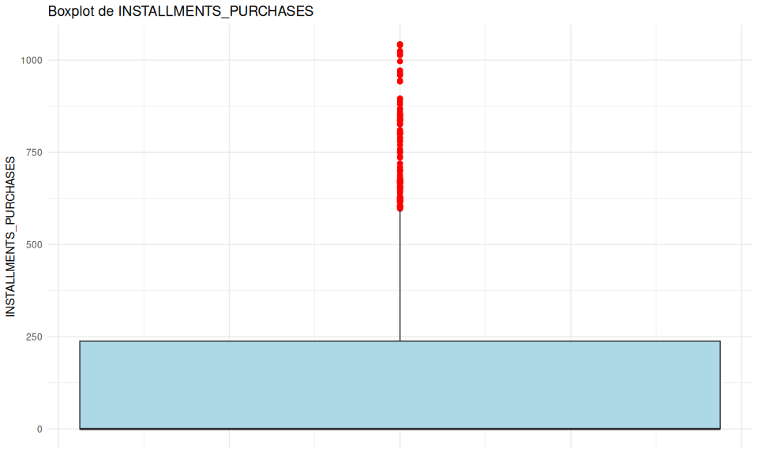<!-- --><!-- --><!-- -->

    ## 
    ## Top 10 outliers (valeurs les plus extrêmes):
    ##      INSTALLMENTS_PURCHASES
    ## 537                 1043.18
    ## 199                 1043.00
    ## 1509                1039.92
    ## 595                 1025.00
    ## 543                 1020.76
    ## 181                 1016.00
    ## 673                 1013.00
    ## 641                  996.66
    ## 235                  972.38
    ## 1283                 968.64
    ## 
    ## ---
    ## 
    ## ### Variable: CASH_ADVANCE 
    ## 
    ## - Nombre d'outliers: 233 / 2035 ( 11.45 %)
    ## - Limites: [ -654.47 , 1090.79 ]
    ## - Q1 = 0 , Q3 = 436.32 , IQR = 436.32

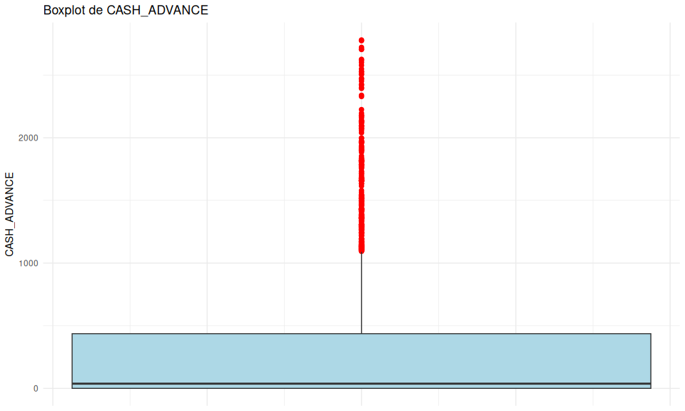<!-- -->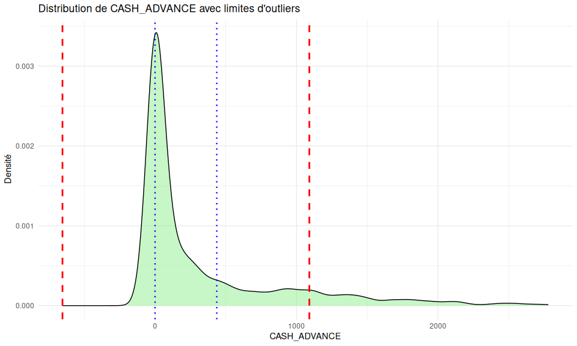<!-- --><!-- -->

    ## 
    ## Top 10 outliers (valeurs les plus extrêmes):
    ##      CASH_ADVANCE
    ## 814      2780.107
    ## 1042     2774.386
    ## 1423     2721.304
    ## 1085     2706.494
    ## 1598     2704.303
    ## 2031     2625.645
    ## 870      2617.931
    ## 1105     2601.135
    ## 609      2577.953
    ## 1080     2548.837
    ## 
    ## ---
    ## 
    ## ### Variable: PURCHASES_FREQUENCY 
    ## 
    ## - Nombre d'outliers: 0 / 2035 ( 0 %)
    ## - Limites: [ -0.94 , 1.56 ]
    ## - Q1 = 0 , Q3 = 0.62 , IQR = 0.62

<!-- --><!-- --><!-- -->

    ## 
    ## ---
    ## 
    ## ### Variable: ONEOFF_PURCHASES_FREQUENCY 
    ## 
    ## - Nombre d'outliers: 277 / 2035 ( 13.61 %)
    ## - Limites: [ -0.12 , 0.21 ]
    ## - Q1 = 0 , Q3 = 0.08 , IQR = 0.08

<!-- --><!-- --><!-- -->

    ## 
    ## Top 10 outliers (valeurs les plus extrêmes):
    ##     ONEOFF_PURCHASES_FREQUENCY
    ## 59                    0.416667
    ## 73                    0.416667
    ## 93                    0.416667
    ## 102                   0.416667
    ## 237                   0.416667
    ## 245                   0.416667
    ## 255                   0.416667
    ## 261                   0.416667
    ## 340                   0.416667
    ## 357                   0.416667
    ## 
    ## ---
    ## 
    ## ### Variable: PURCHASES_INSTALLMENTS_FREQUENCY 
    ## 
    ## - Nombre d'outliers: 0 / 2035 ( 0 %)
    ## - Limites: [ -0.75 , 1.25 ]
    ## - Q1 = 0 , Q3 = 0.5 , IQR = 0.5

<!-- --><!-- --><!-- -->

    ## 
    ## ---
    ## 
    ## ### Variable: CASH_ADVANCE_FREQUENCY 
    ## 
    ## - Nombre d'outliers: 0 / 2035 ( 0 %)
    ## - Limites: [ -0.25 , 0.42 ]
    ## - Q1 = 0 , Q3 = 0.17 , IQR = 0.17

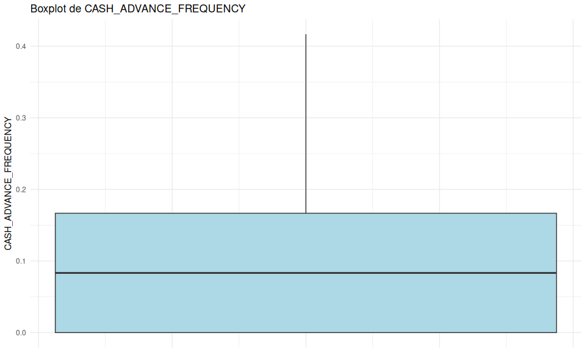<!-- --><!-- --><!-- -->

    ## 
    ## ---
    ## 
    ## ### Variable: CASH_ADVANCE_TRX 
    ## 
    ## - Nombre d'outliers: 0 / 2035 ( 0 %)
    ## - Limites: [ -4.5 , 7.5 ]
    ## - Q1 = 0 , Q3 = 3 , IQR = 3

<!-- --><!-- --><!-- -->

    ## 
    ## ---
    ## 
    ## ### Variable: PURCHASES_TRX 
    ## 
    ## - Nombre d'outliers: 37 / 2035 ( 1.82 %)
    ## - Limites: [ -15 , 25 ]
    ## - Q1 = 0 , Q3 = 10 , IQR = 10

<!-- --><!-- --><!-- -->

    ## 
    ## Top 10 outliers (valeurs les plus extrêmes):
    ##      PURCHASES_TRX
    ## 38              30
    ## 299             30
    ## 1004            30
    ## 1391            30
    ## 1729            30
    ## 594             29
    ## 910             29
    ## 1710            29
    ## 1816            29
    ## 322             28
    ## 
    ## ---
    ## 
    ## ### Variable: CREDIT_LIMIT 
    ## 
    ## - Nombre d'outliers: 175 / 2035 ( 8.6 %)
    ## - Limites: [ -1500 , 5700 ]
    ## - Q1 = 1200 , Q3 = 3000 , IQR = 1800

<!-- --><!-- --><!-- -->

    ## 
    ## Top 10 outliers (valeurs les plus extrêmes):
    ##     CREDIT_LIMIT
    ## 693         7600
    ## 30          7500
    ## 31          7500
    ## 49          7500
    ## 90          7500
    ## 133         7500
    ## 178         7500
    ## 181         7500
    ## 322         7500
    ## 324         7500
    ## 
    ## ---
    ## 
    ## ### Variable: PAYMENTS 
    ## 
    ## - Nombre d'outliers: 85 / 2035 ( 4.18 %)
    ## - Limites: [ -388.91 , 1454.03 ]
    ## - Q1 = 302.19 , Q3 = 762.93 , IQR = 460.74

<!-- --><!-- --><!-- -->

    ## 
    ## Top 10 outliers (valeurs les plus extrêmes):
    ##      PAYMENTS
    ## 1377 1741.996
    ## 259  1738.450
    ## 176  1736.121
    ## 768  1734.837
    ## 1080 1732.275
    ## 1695 1723.351
    ## 260  1721.926
    ## 1415 1713.312
    ## 1127 1713.300
    ## 1445 1711.865
    ## 
    ## ---
    ## 
    ## ### Variable: MINIMUM_PAYMENTS 
    ## 
    ## - Nombre d'outliers: 36 / 2035 ( 1.77 %)
    ## - Limites: [ -344.79 , 1075 ]
    ## - Q1 = 187.63 , Q3 = 542.57 , IQR = 354.95

<!-- -->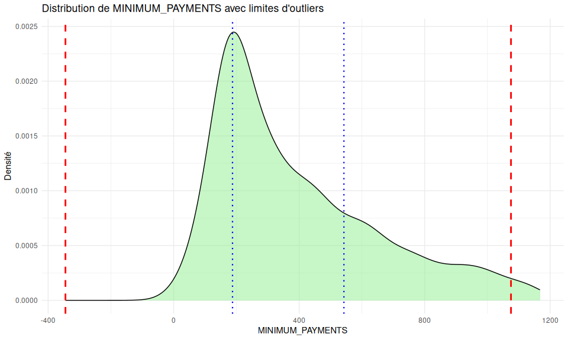<!-- --><!-- -->

    ## 
    ## Top 10 outliers (valeurs les plus extrêmes):
    ##      MINIMUM_PAYMENTS
    ## 735          1167.316
    ## 1741         1164.898
    ## 1940         1159.793
    ## 347          1159.311
    ## 1665         1157.359
    ## 683          1155.325
    ## 618          1152.616
    ## 767          1148.849
    ## 936          1147.377
    ## 605          1145.811
    ## 
    ## ---
    ## 
    ## ### Variable: PRC_FULL_PAYMENT 
    ## 
    ## - Nombre d'outliers: 313 / 2035 ( 15.38 %)
    ## - Limites: [ 0 , 0 ]
    ## - Q1 = 0 , Q3 = 0 , IQR = 0

<!-- --><!-- --><!-- -->

    ## 
    ## Top 10 outliers (valeurs les plus extrêmes):
    ##     PRC_FULL_PAYMENT
    ## 48              0.25
    ## 94              0.25
    ## 150             0.25
    ## 188             0.25
    ## 221             0.25
    ## 251             0.25
    ## 303             0.25
    ## 427             0.25
    ## 444             0.25
    ## 459             0.25
    ## 
    ## ---

## Matrice de corrélation des outliers

``` r
# Créer une matrice binaire indiquant si chaque observation est un outlier pour chaque variable
outliers_matrix <- data.frame(matrix(0, nrow = nrow(data), ncol = length(num_cols)))
colnames(outliers_matrix) <- num_cols

for (i in seq_along(num_cols)) {
  col <- num_cols[i]
  Q1 <- quantile(data[[col]], 0.25, na.rm = TRUE)
  Q3 <- quantile(data[[col]], 0.75, na.rm = TRUE)
  IQR_val <- Q3 - Q1
  lower_bound <- Q1 - 1.5 * IQR_val
  upper_bound <- Q3 + 1.5 * IQR_val
  
  outliers_matrix[, i] <- ifelse(data[[col]] < lower_bound | data[[col]] > upper_bound, 1, 0)
}

# Vérifier quelles colonnes ont une variance non nulle (au moins un outlier et au moins une valeur normale)
valid_cols <- sapply(outliers_matrix, function(x) {
  var_x <- var(x, na.rm = TRUE)
  !is.na(var_x) && var_x > 0
})

cat("Variables avec outliers détectés:\n")
```

    ## Variables avec outliers détectés:

``` r
cat(paste(num_cols[valid_cols], collapse = ", "), "\n\n")
```

    ## BALANCE, BALANCE_FREQUENCY, PURCHASES, ONEOFF_PURCHASES, INSTALLMENTS_PURCHASES, CASH_ADVANCE, ONEOFF_PURCHASES_FREQUENCY, PURCHASES_TRX, CREDIT_LIMIT, PAYMENTS, MINIMUM_PAYMENTS, PRC_FULL_PAYMENT

``` r
if (sum(valid_cols) > 1) {
  # Calculer la corrélation uniquement pour les colonnes avec variance non nulle
  cor_outliers <- cor(outliers_matrix[, valid_cols], use = "complete.obs")
  
  # Heatmap de corrélation
  cor_melted <- melt(cor_outliers)
  print(ggplot(cor_melted, aes(x = Var1, y = Var2, fill = value)) +
    geom_tile() +
    geom_text(aes(label = round(value, 2)), size = 3) +
    scale_fill_gradient2(low = "blue", high = "red", mid = "white", 
                         midpoint = 0, limit = c(-1, 1)) +
    labs(title = "Corrélation entre les outliers des variables", 
         x = "", y = "", fill = "Corrélation") +
    theme_minimal() +
    theme(axis.text.x = element_text(angle = 45, hjust = 1)))
  
  # Afficher les variables qui ont tendance à avoir des outliers ensemble
  cat("\nVariables avec forte corrélation d'outliers (> 0.5):\n")
  high_cor <- which(cor_outliers > 0.5 & cor_outliers < 1, arr.ind = TRUE)
  if (nrow(high_cor) > 0) {
    for (i in 1:nrow(high_cor)) {
      var1 <- rownames(cor_outliers)[high_cor[i, 1]]
      var2 <- colnames(cor_outliers)[high_cor[i, 2]]
      cor_val <- cor_outliers[high_cor[i, 1], high_cor[i, 2]]
      cat(var1, "<->", var2, ":", round(cor_val, 3), "\n")
    }
  } else {
    cat("Aucune forte corrélation détectée.\n")
  }
} else {
  cat("Impossible de calculer la corrélation : pas assez de variables avec des outliers.\n")
  if (sum(valid_cols) == 0) {
    cat("Aucune variable n'a d'outliers détectés.\n")
  } else {
    cat("Une seule variable a des outliers :", num_cols[valid_cols], "\n")
  }
}
```

<!-- -->

    ## 
    ## Variables avec forte corrélation d'outliers (> 0.5):
    ## ONEOFF_PURCHASES_FREQUENCY <-> ONEOFF_PURCHASES : 0.527 
    ## ONEOFF_PURCHASES <-> ONEOFF_PURCHASES_FREQUENCY : 0.527
