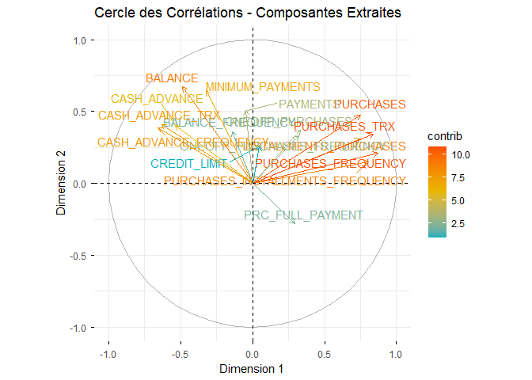

\##load data\_standardise

    data_standardise<-read.csv("../../data/processed/credit_card_clean_standardised.csv")

### Diagonalisation de la matrice de corrélation

    # =================================================================
    # ANALYSE EN COMPOSANTES PRINCIPALES (ACP) - VERSION SÉCURISÉE
    # =================================================================

    library(FactoMineR)
    library(factoextra)

    # 1. Calcul de l'ACP

    res.pca <- PCA(data_standardise, scale.unit = TRUE, ncp = 2, graph = FALSE)

    valeurs_propres <- get_eigenvalue(res.pca)

    # 2. Affichage pour vérification
    print("Résultat de la diagonalisation (Valeurs propres) :")

    ## [1] "Résultat de la diagonalisation (Valeurs propres) :"

    print(round(valeurs_propres, 3))

    ##        eigenvalue variance.percent cumulative.variance.percent
    ## Dim.1       5.030           31.435                      31.435
    ## Dim.2       2.627           16.418                      47.853
    ## Dim.3       2.030           12.690                      60.544
    ## Dim.4       1.589            9.929                      70.472
    ## Dim.5       1.146            7.163                      77.635
    ## Dim.6       0.828            5.174                      82.809
    ## Dim.7       0.705            4.408                      87.217
    ## Dim.8       0.630            3.939                      91.157
    ## Dim.9       0.433            2.709                      93.866
    ## Dim.10      0.412            2.578                      96.443
    ## Dim.11      0.241            1.508                      97.951
    ## Dim.12      0.143            0.892                      98.843
    ## Dim.13      0.104            0.651                      99.495
    ## Dim.14      0.071            0.446                      99.941
    ## Dim.15      0.009            0.058                      99.999
    ## Dim.16      0.000            0.001                     100.000

### Extraction des composantes principales

## Cercle des Corrélations

    # 1. On extrait les coordonnées des variables sur les axes conservés
    # Cela s'appelle aussi les "chargements" (loadings)
    var_extraction <- res.pca$var$coord

    # 2. Affichage des contributions pour les 2 premières composantes
    print("Coordonnées des variables sur les composantes extraites :")

    ## [1] "Coordonnées des variables sur les composantes extraites :"

    print(round(var_extraction[, 1:2], 3))

    ##                                   Dim.1  Dim.2
    ## BALANCE                          -0.489  0.671
    ## BALANCE_FREQUENCY                -0.141  0.360
    ## PURCHASES                         0.750  0.473
    ## ONEOFF_PURCHASES                  0.334  0.370
    ## INSTALLMENTS_PURCHASES            0.749  0.311
    ## CASH_ADVANCE                     -0.539  0.400
    ## PURCHASES_FREQUENCY               0.873  0.210
    ## ONEOFF_PURCHASES_FREQUENCY        0.321  0.332
    ## PURCHASES_INSTALLMENTS_FREQUENCY  0.803  0.152
    ## CASH_ADVANCE_FREQUENCY           -0.657  0.388
    ## CASH_ADVANCE_TRX                 -0.632  0.410
    ## PURCHASES_TRX                     0.841  0.341
    ## CREDIT_LIMIT                      0.047  0.261
    ## PAYMENTS                         -0.046  0.506
    ## MINIMUM_PAYMENTS                 -0.323  0.644
    ## PRC_FULL_PAYMENT                  0.294 -0.279

    # 3. Visualisation : Le Cercle des Corrélations
    # C'est l'outil principal de l'étape d'extraction
    fviz_pca_var(res.pca, 
                 col.var = "contrib", # Couleur selon la contribution
                 gradient.cols = c("#00AFBB", "#E7B800", "#FC4E07"),
                 repel = TRUE) +
      labs(title = "Cercle des Corrélations - Composantes Extraites",
           x = "Dimension 1", y = "Dimension 2")

    # Extraire les coordonnées des individus sur les axes factoriels
    # res.pca$ind$coord contient les scores
    donnees_reduites <- as.data.frame(res.pca$ind$coord)

    # Vérifier le nouveau dataset
    print(donnees_reduites)

    ##           Dim.1        Dim.2
    ## 1    0.04166444 -2.884878562
    ## 2   -0.71457840 -1.526206548
    ## 3    2.45432650  1.038869053
    ## 4    1.64647430  1.135281045
    ## 5   -2.40885914  1.058930207
    ## 6    3.02272301 -0.717887022
    ## 7   -2.41361744  1.873717093
    ## 8    2.57527517 -1.233271993
    ## 9    0.74786051 -1.591388298
    ## 10  -1.80675540 -0.629453903
    ## 11  -2.16746485 -0.635552384
    ## 12  -0.14770354  0.430119850
    ## 13  -2.57525162  0.404298028
    ## 14  -1.12035745 -0.409471298
    ## 15   1.02307051  1.822541708
    ## 16  -3.35579302  0.618009279
    ## 17   1.79416082 -0.045908181
    ## 18   2.69935915 -1.563285835
    ## 19  -2.28377749  2.204118443
    ## 20  -1.38986512 -0.727202077
    ## 21  -1.75020987  4.545198197
    ## 22   4.52729599  0.806602617
    ## 23   1.00304360  1.218607817
    ## 24  -3.39311260  1.681342753
    ## 25   4.58274810  6.870713672
    ## 26   1.71567134 -2.337105163
    ## 27   3.47152600  0.051138945
    ## 28   2.73028467  2.983129408
    ## 29   0.33796356 -0.322649483
    ## 30  -2.22228815  0.284230752
    ## 31   0.27732589  3.069318435
    ## 32  -0.68918311 -0.503330378
    ## 33  -3.73941555  1.882582354
    ## 34   4.22542065  1.352051220
    ## 35   0.45618045  0.762724832
    ## 36  -2.08630717 -0.541206230
    ## 37  -2.38640265  1.967833261
    ## 38   4.00604708  1.922279378
    ## 39   0.34260608  0.605547247
    ## 40   1.07292927 -2.151009033
    ## 41  -0.51741658  2.233372410
    ## 42   1.55361341 -1.783904765
    ## 43  -0.22335261 -2.155149767
    ## 44   3.42609856  1.671531571
    ## 45  -1.21529990 -0.182671346
    ## 46   0.71391842  1.493452662
    ## 47   2.26748252 -1.767670151
    ## 48   1.61848782 -2.812764906
    ## 49  -3.91618445  4.738964075
    ## 50  -0.81043205  0.405760121
    ## 51  -2.35491053  0.592887106
    ## 52  -2.85459210 -0.012107376
    ## 53   2.93654292 -1.523386445
    ## 54  -3.47825824  1.355217161
    ## 55  -2.71959031  1.290434449
    ## 56  -1.67071825  0.518436503
    ## 57  -0.51575535  0.174616352
    ## 58  -1.70295236 -0.709683202
    ## 59   3.47043985  1.365765112
    ## 60  -2.47249958 -0.064844164
    ## 61   0.26898754 -1.299462330
    ## 62  -2.13007989 -0.482533681
    ## 63  -1.36201949 -1.095852118
    ## 64  -1.03723676 -0.739031069
    ## 65   1.32746938 -1.076871420
    ## 66  -0.21134920 -1.392205576
    ## 67   2.05981957 -0.980106401
    ## 68   1.42723340  4.555079562
    ## 69  -1.89400578 -0.351322293
    ## 70  -2.40459937 -0.385581633
    ## 71  -1.51857385 -1.368850180
    ## 72  -1.52197599 -1.478559442
    ## 73   4.18165760  1.624086049
    ## 74  -0.35204922 -0.158286203
    ## 75   4.17008780  2.579491068
    ## 76  -1.50791842 -1.363590882
    ## 77  -1.71946525 -0.710203831
    ## 78  -0.09622512 -1.277965684
    ## 79  -2.78752846  0.737257720
    ## 80   5.21291467  2.106824738
    ## 81  -2.24757377 -0.785677206
    ## 82   0.60390681 -0.619131360
    ## 83   1.18706954  4.656355051
    ## 84  -0.57908894 -0.878683871
    ## 85  -2.12065668 -0.323614828
    ## 86  -2.27210941 -0.769657695
    ## 87  -2.97994659  1.745661349
    ## 88  -0.28222243  1.778760715
    ## 89  -0.88700807 -0.748392929
    ## 90   2.45102650  0.912572248
    ## 91   2.11186751  3.183752176
    ## 92   3.33396917 -1.314889589
    ## 93   3.08987180  3.979581419
    ## 94   3.14223575 -1.174926913
    ## 95  -2.21847901 -0.455503433
    ## 96  -1.02053573 -2.194878536
    ## 97  -1.85015843  0.453804610
    ## 98  -3.61481808  2.077336603
    ## 99   1.47964114  0.854871807
    ## 100  2.85870561  2.169760481
    ## 101  2.18705610  0.076749734
    ## 102 -0.43831556  2.412179348
    ## 103  0.09204614  0.408179236
    ## 104 -0.43394732 -1.101209043
    ## 105 -0.26683493 -2.469376202
    ## 106 -1.55417513 -0.172277166
    ## 107  0.97447343 -0.213573985
    ## 108 -4.00554142  2.186368741
    ## 109  0.19908846 -2.052320309
    ## 110 -2.00456833 -1.054118943
    ## 111 -0.52938027  2.094634591
    ## 112 -0.51911231  0.131287050
    ## 113  2.73990087  0.076719479
    ## 114  2.35137102  2.135766198
    ## 115  1.67919202 -0.953403959
    ## 116 -2.24870849  1.077541766
    ## 117 -3.62315065  1.070038573
    ## 118  0.40781139 -0.732143613
    ## 119 -0.07540729 -0.397335342
    ## 120 -1.60352831  1.045481523
    ## 121  4.03872588  1.801655617
    ## 122 -2.52391073 -0.054175455
    ## 123 -2.26201717 -0.397197423
    ## 124  3.70812985  4.043007176
    ## 125  3.65947593 -0.711048756
    ## 126 -2.34584509 -0.600807872
    ## 127 -1.08687433 -1.703186917
    ## 128  1.81051363  3.354020923
    ## 129 -3.86034752  2.264341452
    ## 130 -1.63814284 -1.361727660
    ## 131  2.81026257 -1.134344807
    ## 132 -2.01709566  0.009782912
    ## 133 -0.24589915  0.739144745
    ## 134 -0.04383960  1.001476458
    ## 135  0.58790518 -0.411514181
    ## 136 -0.77347817 -1.798350765
    ## 137 -0.82855779 -1.335421031
    ## 138  0.21534100 -1.365487406
    ## 139  2.47936302  1.717588487
    ## 140  0.18748220 -0.745724105
    ## 141  1.48707354 -0.175385146
    ## 142 -2.37730847 -0.344553152
    ## 143  2.95387649  1.661572553
    ## 144  2.24494920  5.181308552
    ## 145  0.90320923  2.971583661
    ## 146 -1.92159464 -0.555050373
    ## 147  0.85407561 -2.247847673
    ## 148 -0.02074986 -1.411139557
    ## 149 -1.00820689 -2.322005780
    ## 150  3.30963588 -1.217721734
    ## 151 -3.43718793  1.516001578
    ## 152 -0.61635334  3.901799677
    ## 153 -0.09778976 -2.585165192
    ## 154 -1.57375608 -1.245128146
    ## 155 -2.05834343  0.117680280
    ## 156  2.34780264 -0.330320874
    ## 157 -1.51498248  1.359036800
    ## 158 -1.16492510 -1.127539816
    ## 159 -1.86604152 -0.047837924
    ## 160  6.13563866  3.309802508
    ## 161 -0.77432776  0.581465249
    ## 162 -2.21559963 -0.862938940
    ## 163 -0.40243757 -1.265928761
    ## 164  2.34883265 -2.131819078
    ## 165 -1.49602039 -1.361763210
    ## 166 -1.02021797 -1.306365899
    ## 167 -1.30995820  0.850632657
    ## 168 -2.17759780  2.910017449
    ## 169 -0.59147534 -2.028429512
    ## 170  4.06565542  2.496036605
    ## 171 -1.72498440 -0.184696150
    ## 172 -3.23890332  0.539401559
    ## 173  0.94915273 -0.129114611
    ## 174  0.61139468  0.398572278
    ## 175  0.79828102 -1.215182199
    ## 176 -3.36721867  2.134885509
    ## 177  0.20405599 -0.339559106
    ## 178 -3.63742130  1.589322670
    ## 179 -1.62019226 -1.345219248
    ## 180 -2.57059923 -0.303141252
    ## 181  3.64099850  4.770248424
    ## 182 -2.28132219  0.712712065
    ## 183 -1.07832151 -0.087132025
    ## 184  2.88283690 -0.767819933
    ## 185  2.34575413 -2.888740842
    ## 186  1.07694550 -2.472489230
    ## 187  0.75144523  0.897683266
    ## 188  5.85311675  0.410484045
    ## 189 -1.75718711 -1.499567806
    ## 190 -3.26113341  1.662729756
    ## 191 -0.47498994  0.165674663
    ## 192  3.26482551 -0.419996827
    ## 193  2.01339425 -1.771269285
    ## 194 -0.13763890 -0.121076303
    ## 195  3.07839490  4.221552797
    ## 196 -0.23313448 -0.667657210
    ## 197  4.88435528 -0.051706501
    ## 198 -0.09090322  1.079756189
    ## 199  1.44289850  4.641399523
    ## 200  3.04293785  0.712187127
    ## 201  1.93585140 -1.382565764
    ## 202 -0.02230167  1.205747256
    ## 203 -2.17851771 -0.181168552
    ## 204 -0.39158220 -0.889705467
    ## 205 -2.85113492  1.239835047
    ## 206  2.81152747 -1.673621537
    ## 207  1.75052983  1.902901611
    ## 208  3.75375044  0.020530239
    ## 209 -2.29877079  0.981690081
    ## 210  1.77579200 -0.568262531
    ## 211 -1.27179480  0.120154940
    ## 212 -1.75390857 -0.780218466
    ## 213 -1.30927655 -1.609598410
    ## 214 -1.18846971 -0.900571985
    ## 215  0.27299180  2.090609110
    ## 216  1.63049407  1.475617013
    ## 217 -2.52637868  0.448850675
    ## 218 -2.80875461  1.352941252
    ## 219  1.57723751  0.629260127
    ## 220  2.98642067 -1.841321874
    ## 221  1.72266005 -1.226663986
    ## 222 -1.59923990 -1.220328557
    ## 223  3.32433743  1.804771123
    ## 224 -1.37761186  0.607547600
    ## 225  0.99428316 -1.130554398
    ## 226 -2.64244977 -0.037705520
    ## 227  1.01423200  0.276539243
    ## 228 -3.23135029  1.176307555
    ## 229 -1.42934767 -1.608179269
    ## 230  1.43806362  0.040822468
    ## 231 -1.15647815 -1.448148728
    ## 232 -2.30927559 -0.160250174
    ## 233  0.56553911  3.659461936
    ## 234 -3.67426408  3.245518344
    ## 235  4.52150793  1.905554297
    ## 236 -0.15024265 -0.165987114
    ## 237  5.47235721  4.365298370
    ## 238 -0.12455184 -3.540107553
    ## 239  2.41435844  1.948094196
    ## 240 -1.57491106  2.445398706
    ## 241 -0.63261098 -1.210845709
    ## 242  2.40964926 -1.941108941
    ## 243 -2.45302622  0.080923566
    ## 244  1.57742595  1.144050256
    ## 245 -1.92591077  2.260278777
    ## 246 -2.66467882  1.114538157
    ## 247  2.55771691  1.854858825
    ## 248 -1.89904380 -1.126585260
    ## 249 -0.67807368 -1.587743816
    ## 250 -0.19788831  2.031704305
    ## 251  3.67581353 -1.501410014
    ## 252  1.66668908  1.104143834
    ## 253  3.38815937 -1.016603009
    ## 254 -0.12840653  0.872951673
    ## 255  1.25537080  0.473203819
    ## 256 -0.11056140  1.182248924
    ## 257 -0.28784408 -0.839660724
    ## 258  1.27999463 -0.659150073
    ## 259  2.58637108  1.141028280
    ## 260 -1.86351239 -0.694130611
    ## 261  3.40407540  2.322596198
    ## 262  0.93416326  1.229537567
    ## 263  3.70584161  2.366926809
    ## 264  0.26596363  1.434951923
    ## 265 -2.76605031 -0.234359141
    ## 266 -0.34372665 -0.728558261
    ## 267 -1.80867134 -1.004703485
    ## 268 -2.93915146  0.447055225
    ## 269  2.18972365  0.663447372
    ## 270 -2.91494148  1.048505795
    ## 271 -1.65871845  0.232198356
    ## 272 -2.39712520  0.352005903
    ## 273  1.12115096  0.472039298
    ## 274  1.74688387 -1.692823855
    ## 275  0.19432980  0.145642840
    ## 276 -2.08456999  0.597708608
    ## 277 -0.71933266 -2.574888707
    ## 278 -1.87375829 -0.623649392
    ## 279 -2.57996208 -0.155708748
    ## 280 -0.36710659 -1.267138438
    ## 281  2.18076209  0.850448000
    ## 282 -2.93055108  0.654807105
    ## 283  1.58913162  2.532190332
    ## 284 -1.93413944 -0.813565679
    ## 285 -0.09953577  0.549058939
    ## 286 -2.33000255 -0.281339585
    ## 287  1.89081272  0.844939130
    ## 288  5.79958372  3.996699771
    ## 289 -2.64222244  1.234445702
    ## 290 -2.81593402  0.019953354
    ## 291 -2.27397159 -0.246823822
    ## 292  5.47020131  1.753332021
    ## 293 -0.27115132 -1.856831579
    ## 294 -3.13485008  2.065676315
    ## 295 -3.58949954  2.428797604
    ## 296  0.74873224  2.223250389
    ## 297  1.36128888  2.142969302
    ## 298 -0.87467088  1.493695965
    ## 299  4.60140702  0.490985762
    ## 300  1.29226932  1.569373587
    ## 301  3.01509713 -0.263123696
    ## 302 -2.00828656 -0.762313165
    ## 303  2.93759746 -1.755862182
    ## 304 -2.21248493 -0.478974152
    ## 305  3.63303608  1.099310424
    ## 306 -0.25230365 -1.206937372
    ## 307  1.11641691  0.011512364
    ## 308 -3.44477861  1.713206287
    ## 309 -1.86226395 -0.429363130
    ## 310  0.08196159 -1.057828173
    ## 311  1.14360409 -2.984218630
    ## 312  2.52773859  0.740287588
    ## 313  1.13516420  0.019960748
    ## 314  4.49086011  0.032364658
    ## 315 -2.14081611  0.096532976
    ## 316  0.39786045  3.268889088
    ## 317 -2.96490597  0.191843515
    ## 318  3.94675020  0.539642668
    ## 319  2.06487534  1.210354263
    ## 320 -2.24197187 -0.165719578
    ## 321  0.50073316 -1.464000694
    ## 322  4.52230322  2.589920117
    ## 323  2.57781596 -3.063719103
    ## 324  2.24680723  2.723072491
    ## 325 -2.32141884 -0.811598393
    ## 326  1.22017009 -0.744172150
    ## 327 -1.43613411 -1.594184734
    ## 328 -2.22852751  0.190899725
    ## 329  2.84097376 -1.528218460
    ## 330 -2.64542955  0.543908049
    ## 331 -2.07699043  0.474420869
    ## 332 -2.72666610  0.253646104
    ## 333 -1.80126180 -0.536368429
    ## 334  3.20259297  2.136702447
    ## 335  3.94789460  1.757394295
    ## 336  0.18579972  1.116431694
    ## 337  0.38840468  1.585206477
    ## 338 -3.73847898  2.079905892
    ## 339  1.39198140  0.338008623
    ## 340  2.58554774  0.401414287
    ## 341 -2.77859756 -0.172466087
    ## 342  1.89162641  1.807655781
    ## 343  0.27961187 -0.945593555
    ## 344  2.54814123  1.124973867
    ## 345 -1.62025200 -1.126383400
    ## 346  0.57462842  0.023306299
    ## 347 -1.61807065  1.223238872
    ## 348 -0.16504029 -0.148351799
    ## 349 -0.45969480 -0.468080884
    ## 350 -2.20509086  4.181305806
    ## 351  0.31834701  0.717313035
    ## 352 -2.90625699  0.630424977
    ## 353 -0.33556187 -1.519959756
    ## 354 -3.56382059  1.231782551
    ## 355  2.00250808 -0.238940676
    ## 356 -2.72611717  1.305373734
    ## 357  1.84054774  1.287630633
    ## 358 -0.44045938 -1.702339392
    ## 359 -2.86566079  0.853790891
    ## 360 -3.12995126  1.020698828
    ## 361 -2.22897514  0.164297341
    ## 362 -2.43068221  0.419603426
    ## 363  2.48316189  0.864849749
    ## 364 -2.31786600  0.429743798
    ## 365  1.53955005  0.857202180
    ## 366 -1.88147157  1.328432650
    ## 367 -0.43343010 -2.127365894
    ## 368  2.21605694 -1.645259599
    ## 369  0.70558167 -1.416177622
    ## 370 -2.25320269  0.721324627
    ## 371  3.17879888 -0.190803802
    ## 372  1.52521290  1.503643054
    ## 373 -1.88304617 -0.240979698
    ## 374  3.61238239  1.892665581
    ## 375 -2.56961358  1.089936430
    ## 376  3.95936988 -0.983695843
    ## 377 -1.54158156 -1.280942322
    ## 378  2.70118709 -1.425037873
    ## 379 -2.73459003  0.460642630
    ## 380 -2.11681682  0.391329415
    ## 381 -2.08906090  0.186013659
    ## 382 -2.69477346  2.508496228
    ## 383  2.07473859 -0.689265887
    ## 384  1.82805431 -2.426202602
    ## 385 -2.23415782  0.863127199
    ## 386  2.46274255 -2.151461988
    ## 387 -2.03067134 -0.778726785
    ## 388 -0.12892438 -1.940083008
    ## 389 -1.72414942 -0.832385597
    ## 390 -2.19138942 -0.581087117
    ## 391 -1.19074515 -2.329694023
    ## 392 -1.78086957 -0.612959553
    ## 393 -0.70094247  0.008480267
    ## 394  2.24547560 -1.274562559
    ## 395 -1.15821035 -1.094377934
    ## 396 -1.64855484 -1.028876683
    ## 397  2.60712683 -0.642084604
    ## 398 -0.59096839 -1.574468235
    ## 399  0.34355845 -0.075266193
    ## 400 -0.39491487  0.286173461
    ## 401 -1.98337828 -0.804624969
    ## 402 -2.87622713  0.661956325
    ## 403  2.58701300  0.170986900
    ## 404 -2.73932229  0.894121858
    ## 405  1.52489710  3.138700250
    ## 406 -1.37217773 -1.851378185
    ## 407 -2.23280860 -0.815688404
    ## 408 -0.32390380 -1.684488381
    ## 409  1.41891676  2.480706802
    ## 410 -2.58565198  1.970647057
    ## 411  3.52657782 -0.455529286
    ## 412 -1.64158287 -1.046789058
    ## 413  0.40631382 -0.568203518
    ## 414  1.39680923  4.301761381
    ## 415  2.20941478 -1.036189358
    ## 416 -2.44641173  0.189078947
    ## 417  4.31842810  0.903780543
    ## 418 -1.98934665  0.819692525
    ## 419  3.85417721 -0.011775599
    ## 420  0.86369204 -1.281199699
    ## 421  2.44364620  3.553783369
    ## 422 -0.20177365 -1.943352775
    ## 423 -3.14795892  1.438961762
    ## 424 -2.10900269 -0.563898128
    ## 425  1.22379841 -1.628191890
    ## 426  2.41430598  0.971146240
    ## 427  3.87478908 -1.602640591
    ## 428  4.08224549  1.026053094
    ## 429  2.73334624  0.214860688
    ## 430 -2.60000758  0.839376362
    ## 431  0.44321916  3.862384620
    ## 432 -1.14640153 -0.785928262
    ## 433  3.26635213  1.306688369
    ## 434 -2.09438484 -1.520423983
    ## 435  1.72302828 -0.548548852
    ## 436 -0.40778694  0.882059837
    ## 437  0.16672237  0.392696985
    ## 438 -0.80680081  0.131509276
    ## 439 -3.27273705  1.964902711
    ## 440 -1.44461045 -1.613954238
    ## 441 -2.14297121 -0.661110213
    ## 442 -0.31993831  1.500706681
    ## 443 -2.02908941 -0.946421239
    ## 444  5.75761496  3.941604226
    ## 445  2.62583967  0.637561203
    ## 446 -2.34840117  0.442550788
    ## 447 -1.61954324  0.055206295
    ## 448 -2.47773371  0.601258676
    ## 449 -3.30102522  0.856770673
    ## 450 -2.27232516  0.507707010
    ## 451  2.62686897  0.242506831
    ## 452 -2.15780945 -0.440535183
    ## 453 -1.91013115 -1.024918160
    ## 454 -1.71877766 -0.818270589
    ## 455  0.80182051  0.597824542
    ## 456 -3.13051889  0.460606805
    ## 457 -1.42956702 -1.616650491
    ## 458  0.08950344 -1.684054653
    ## 459  2.51253484  1.262586997
    ## 460  1.55002603 -1.418876395
    ## 461 -0.47578392 -0.054472703
    ## 462  0.51503705  1.689750617
    ## 463  1.26047501  2.254330452
    ## 464 -0.84831197 -1.527350327
    ## 465 -1.66408406  1.389131207
    ## 466 -2.00209085 -1.336096269
    ## 467  1.43095996 -0.748976358
    ## 468  3.22152818  0.561482793
    ## 469 -0.19809099 -0.447407362
    ## 470  2.29449888  0.147895054
    ## 471  3.71533112 -0.919682639
    ## 472  1.67177236 -0.237195085
    ## 473 -2.03556079 -0.522715478
    ## 474  0.07582347 -1.115005119
    ## 475 -1.92974390 -0.899212525
    ## 476 -0.29102200 -0.497234750
    ## 477 -0.94398145 -1.199635594
    ## 478  1.65738199  3.071537388
    ## 479 -2.15557612 -0.498704049
    ## 480  0.39842797 -0.597819237
    ## 481  1.21858016 -2.467878697
    ## 482 -0.88044533 -1.136636837
    ## 483  2.59127314 -1.218739454
    ## 484  2.59201208 -1.159751006
    ## 485 -3.57058615  1.359032732
    ## 486  1.93528475 -1.254254687
    ## 487  2.48213973  0.567284091
    ## 488  2.59617533 -0.921068081
    ## 489 -2.84958539  0.338887758
    ## 490 -1.69968036 -0.895850921
    ## 491  2.60350530 -0.680670173
    ## 492  2.01610998  0.563308993
    ## 493 -4.28190997  3.125029038
    ## 494 -3.78162146  2.139068053
    ## 495 -3.14359694  1.728944973
    ## 496  1.22000707 -1.256984030
    ## 497  2.26418883 -1.056817878
    ## 498  1.27715175  3.089991356
    ## 499 -2.95920696  0.445001170
    ## 500  4.29791875 -0.287410333
    ##  [ reached 'max' / getOption("max.print") -- omitted 1535 rows ]

## matrice de correlation entre nos variables et les nouvelles axes

    write.csv(donnees_reduites, "../../data/processed\\data_after_ACP.csv", row.names = FALSE)
    print(res.pca$var$coord)

    ##                                        Dim.1      Dim.2
    ## BALANCE                          -0.48902767  0.6711018
    ## BALANCE_FREQUENCY                -0.14116606  0.3602039
    ## PURCHASES                         0.74978897  0.4725885
    ## ONEOFF_PURCHASES                  0.33431336  0.3703220
    ## INSTALLMENTS_PURCHASES            0.74917877  0.3107144
    ## CASH_ADVANCE                     -0.53906475  0.4004040
    ## PURCHASES_FREQUENCY               0.87332934  0.2103526
    ## ONEOFF_PURCHASES_FREQUENCY        0.32113792  0.3316369
    ## PURCHASES_INSTALLMENTS_FREQUENCY  0.80346894  0.1519754
    ## CASH_ADVANCE_FREQUENCY           -0.65707352  0.3876397
    ## CASH_ADVANCE_TRX                 -0.63228389  0.4104415
    ## PURCHASES_TRX                     0.84082914  0.3412041
    ## CREDIT_LIMIT                      0.04674838  0.2607260
    ## PAYMENTS                         -0.04600641  0.5059647
    ## MINIMUM_PAYMENTS                 -0.32264556  0.6442084
    ## PRC_FULL_PAYMENT                  0.29397094 -0.2792557

## L’inertie totale expliquée par les deux premiers axes

    # 1. On s'assure que eig.val est un data.frame
    eig.val <- as.data.frame(get_eigenvalue(res.pca))

    # 2. On récupère la valeur cumulée de la 2ème ligne (Dim 1 + Dim 2)
    # On utilise les crochets [ligne, colonne] pour être 100% sûr
    inertie_2_axes <- eig.val[2, "cumulative.variance.percent"]

    # 3. Affichage propre
    cat("L'inertie totale expliquée par les deux premiers axes est de :", 
        round(inertie_2_axes, 2), "%\n")

    ## L'inertie totale expliquée par les deux premiers axes est de : 47.85 %

\##Calcul des scores des individus

    # 1. Extraction des coordonnées des individus (les scores)
    # On se limite aux axes conservés (ici Dim 1 et Dim 2)
    scores_ind <- as.data.frame(res.pca$ind$coord[, 1:2])

    # 2. Renommer les colonnes pour plus de clarté
    colnames(scores_ind) <- c("Score_Depense", "Score_Tresorerie")

    # 3. Aperçu des scores pour les 5 premiers clients
    head(scores_ind)

    ##   Score_Depense Score_Tresorerie
    ## 1    0.04166444        -2.884879
    ## 2   -0.71457840        -1.526207
    ## 3    2.45432650         1.038869
    ## 4    1.64647430         1.135281
    ## 5   -2.40885914         1.058930
    ## 6    3.02272301        -0.717887

## Contributions des variables

    # 1. Visualiser les contributions sur l'Axe 1
    # fviz_contrib(res.pca, choice = "var", axes = 1, top = 10)
    fviz_contrib(res.pca, choice = "var", axes = 2, top = 10)

## Corrélations variables–composantes

    library(corrplot)
    # res.pca est le résultat de ton ACP : PCA(data)
    matrice_corr <- res.pca$var$cor

    # Afficher les corrélations pour les 5 premiers axes
    corrplot(matrice_corr, 
             method = "color",       # Remplit les carrés avec de la couleur
             type = "full",          # Affiche la matrice complète
             addCoef.col = "black",  # Affiche les coefficients de corrélation en noir
             tl.col = "black",       # Couleur des étiquettes (noms des variables)
             tl.srt = 45,            # Incline les noms des variables à 45 degrés
             diag = TRUE,            # Affiche la diagonale (toujours égale à 1)
             number.cex = 0.7,       # Taille des chiffres à l'intérieur
             col = colorRampPalette(c("blue", "white", "red"))(200), # Dégradé bleu-blanc-rouge
             title = "Corrélation entre les variables",
             mar = c(0,0,1,0))       # Ajuste les marges pour que le titre s'affiche

