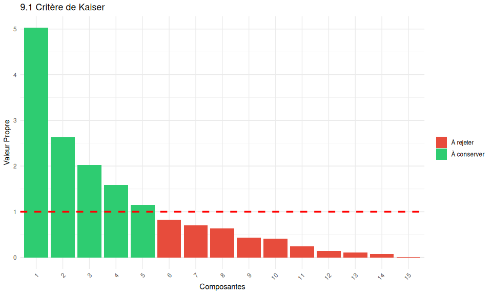
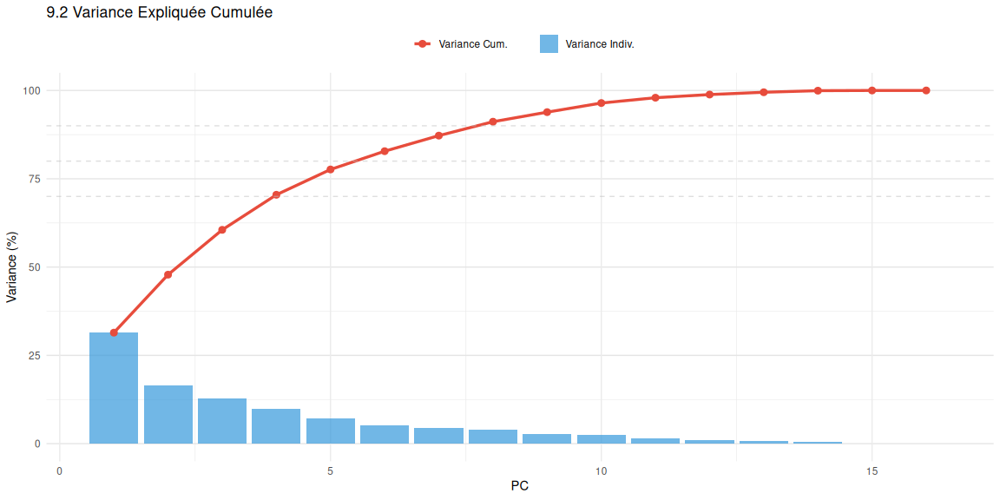

9. Choix du nombre optimal de composantes principales
================

- [9.1 Critère de Kaiser](#91-critère-de-kaiser)
- [9.2 Variance expliquée cumulée](#92-variance-expliquée-cumulée)
- [9.3 Analyse du graphique des valeurs propres (Scree
  plot)](#93-analyse-du-graphique-des-valeurs-propres-scree-plot)
- [Recommandation Finale](#recommandation-finale)

# 9.1 Critère de Kaiser

``` r
kaiser_cutoff <- 1
n_components_kaiser <- sum(eigenvalues > kaiser_cutoff)

cat("Critère de Kaiser (λ > 1):\n")
```

    ## Critère de Kaiser (λ > 1):

``` r
cat("Composantes à conserver:", n_components_kaiser, "\n")
```

    ## Composantes à conserver: 5

``` r
cat("Variance expliquée:", round(cumulative_variance[n_components_kaiser] * 100, 2), "%\n\n")
```

    ## Variance expliquée: 77.64 %

``` r
kaiser_table <- data.frame(
  PC = paste("PC", 1:min(12, length(eigenvalues)), sep = ""),
  Eigenvalue = round(eigenvalues[1:min(12, length(eigenvalues))], 4),
  Keep = ifelse(eigenvalues[1:min(12, length(eigenvalues))] > kaiser_cutoff, "OUI", "NON")
)
print(kaiser_table)
```

    ##           PC Eigenvalue Keep
    ## comp 1   PC1     5.0296  OUI
    ## comp 2   PC2     2.6269  OUI
    ## comp 3   PC3     2.0305  OUI
    ## comp 4   PC4     1.5886  OUI
    ## comp 5   PC5     1.1461  OUI
    ## comp 6   PC6     0.8278  NON
    ## comp 7   PC7     0.7053  NON
    ## comp 8   PC8     0.6303  NON
    ## comp 9   PC9     0.4334  NON
    ## comp 10 PC10     0.4125  NON
    ## comp 11 PC11     0.2413  NON
    ## comp 12 PC12     0.1427  NON

``` r
kaiser_df <- data.frame(
  PC = 1:min(15, length(eigenvalues)),
  Eigenvalue = eigenvalues[1:min(15, length(eigenvalues))]
)

ggplot(kaiser_df, aes(x = factor(PC, levels = PC))) +
  geom_bar(aes(y = Eigenvalue, fill = Eigenvalue > 1), stat = "identity") +
  geom_hline(yintercept = 1, color = "red", linetype = "dashed", linewidth = 1.2) +
  scale_fill_manual(values = c("TRUE" = "#2ecc71", "FALSE" = "#e74c3c"),
                    labels = c("TRUE" = "À conserver", "FALSE" = "À rejeter")) +
  labs(title = "9.1 Critère de Kaiser", x = "Composantes", y = "Valeur Propre", fill = "") +
  theme_minimal() +
  theme(axis.text.x = element_text(angle = 45, hjust = 1),
        panel.grid.major.y = element_line(color = "gray90"))
```

<!-- -->

# 9.2 Variance expliquée cumulée

``` r
thresholds <- c(0.70, 0.75, 0.80, 0.85, 0.90, 0.95)

variance_thresholds <- data.frame()
for (threshold in thresholds) {
  n_comp <- which(cumulative_variance >= threshold)[1]
  variance_thresholds <- rbind(variance_thresholds, data.frame(
    Threshold = paste(threshold * 100, "%", sep = ""),
    N_Components = n_comp,
    Actual_Variance = round(cumulative_variance[n_comp] * 100, 2)
  ))
}

print(variance_thresholds)
```

    ##         Threshold N_Components Actual_Variance
    ## comp 4        70%            4           70.47
    ## comp 5        75%            5           77.64
    ## comp 6        80%            6           82.81
    ## comp 7        85%            7           87.22
    ## comp 8        90%            8           91.16
    ## comp 10       95%           10           96.44

``` r
n_70 <- which(cumulative_variance >= 0.70)[1]
n_80 <- which(cumulative_variance >= 0.80)[1]
n_90 <- which(cumulative_variance >= 0.90)[1]
```

``` r
variance_df <- data.frame(
  PC = 1:min(20, length(eigenvalues)),
  Individual = variance_explained[1:min(20, length(eigenvalues))] * 100,
  Cumulative = cumulative_variance[1:min(20, length(eigenvalues))] * 100
)

ggplot(variance_df, aes(x = PC)) +
  geom_bar(aes(y = Individual, fill = "Variance Indiv."), stat = "identity", alpha = 0.7) +
  geom_line(aes(y = Cumulative, color = "Variance Cum."), linewidth = 1.2, group = 1) +
  geom_point(aes(y = Cumulative, color = "Variance Cum."), size = 2.5) +
  geom_hline(yintercept = c(70, 80, 90), linetype = "dashed", color = "gray", alpha = 0.5) +
  scale_fill_manual(values = c("Variance Indiv." = "#3498db")) +
  scale_color_manual(values = c("Variance Cum." = "#e74c3c")) +
  labs(title = "9.2 Variance Expliquée Cumulée", x = "PC", y = "Variance (%)",
       fill = "", color = "") +
  theme_minimal() +
  theme(legend.position = "top", panel.grid.major.y = element_line(color = "gray90"))
```

<!-- -->

``` r
detail_table <- data.frame(
  PC = 1:min(15, length(eigenvalues)),
  Eigenvalue = round(eigenvalues[1:min(15, length(eigenvalues))], 4),
  Var_Indiv = round(variance_explained[1:min(15, length(eigenvalues))] * 100, 2),
  Var_Cumul = round(cumulative_variance[1:min(15, length(eigenvalues))] * 100, 2)
)
print(detail_table)
```

    ##         PC Eigenvalue Var_Indiv Var_Cumul
    ## comp 1   1     5.0296     31.44     31.44
    ## comp 2   2     2.6269     16.42     47.85
    ## comp 3   3     2.0305     12.69     60.54
    ## comp 4   4     1.5886      9.93     70.47
    ## comp 5   5     1.1461      7.16     77.64
    ## comp 6   6     0.8278      5.17     82.81
    ## comp 7   7     0.7053      4.41     87.22
    ## comp 8   8     0.6303      3.94     91.16
    ## comp 9   9     0.4334      2.71     93.87
    ## comp 10 10     0.4125      2.58     96.44
    ## comp 11 11     0.2413      1.51     97.95
    ## comp 12 12     0.1427      0.89     98.84
    ## comp 13 13     0.1042      0.65     99.49
    ## comp 14 14     0.0714      0.45     99.94
    ## comp 15 15     0.0092      0.06    100.00

# 9.3 Analyse du graphique des valeurs propres (Scree plot)

``` r
scree_df <- data.frame(
  PC = 1:min(20, length(eigenvalues)),
  Eigenvalue = eigenvalues[1:min(20, length(eigenvalues))]
)

ggplot(scree_df, aes(x = PC, y = Eigenvalue)) +
  geom_line(color = "#2c3e50", linewidth = 1.2) +
  geom_point(color = "#e74c3c", size = 3.5) +
  geom_hline(yintercept = 1, linetype = "dashed", color = "blue", alpha = 0.6, linewidth = 1) +
  annotate("text", x = 18, y = 1.1, label = "Kaiser λ=1", color = "blue", size = 3.5) +
  labs(title = "9.3 Scree Plot - Analyse des Valeurs Propres", x = "Composante", y = "Valeur Propre") +
  theme_minimal() +
  theme(panel.grid.major = element_line(color = "gray90"))
```

<!-- -->

``` r
diff_eigenvalues <- diff(eigenvalues)
pct_change <- abs(diff_eigenvalues) / eigenvalues[1:(length(eigenvalues)-1)] * 100

change_table <- data.frame(
  PC = 1:(min(14, length(diff_eigenvalues))),
  Eigenvalue = round(eigenvalues[1:(min(14, length(diff_eigenvalues)))], 4),
  Pct_Change = c(NA, round(pct_change[1:(min(13, length(pct_change)))], 2))
)

print(change_table)
```

    ##         PC Eigenvalue Pct_Change
    ## comp 1   1     5.0296         NA
    ## comp 2   2     2.6269      47.77
    ## comp 3   3     2.0305      22.71
    ## comp 4   4     1.5886      21.76
    ## comp 5   5     1.1461      27.86
    ## comp 6   6     0.8278      27.77
    ## comp 7   7     0.7053      14.79
    ## comp 8   8     0.6303      10.64
    ## comp 9   9     0.4334      31.23
    ## comp 10 10     0.4125       4.84
    ## comp 11 11     0.2413      41.51
    ## comp 12 12     0.1427      40.83
    ## comp 13 13     0.1042      26.98
    ## comp 14 14     0.0714      31.53

# Recommandation Finale

``` r
optimal_n <- n_80

cat("Résumé des critères:\n\n")
```

    ## Résumé des critères:

``` r
cat("1. Critère de Kaiser:       ", n_components_kaiser, " composantes (", 
    round(cumulative_variance[n_components_kaiser]*100, 2), "% de variance)\n")
```

    ## 1. Critère de Kaiser:        5  composantes ( 77.64 % de variance)

``` r
cat("2. Variance expliquée 70%:  ", n_70, " composantes\n")
```

    ## 2. Variance expliquée 70%:   4  composantes

``` r
cat("3. Variance expliquée 80%:  ", n_80, " composantes\n")
```

    ## 3. Variance expliquée 80%:   6  composantes

``` r
cat("4. Variance expliquée 90%:  ", n_90, " composantes\n\n")
```

    ## 4. Variance expliquée 90%:   8  composantes

``` r
cat("✓ RECOMMANDATION FINALE:\n")
```

    ## ✓ RECOMMANDATION FINALE:

``` r
cat("  Nombre de composantes à retenir: ", optimal_n, "\n")
```

    ##   Nombre de composantes à retenir:  6

``` r
cat("  Variance expliquée: ", round(cumulative_variance[optimal_n] * 100, 2), "%\n")
```

    ##   Variance expliquée:  82.81 %

``` r
cat("  Composantes: PC1 à PC", optimal_n, "\n\n")
```

    ##   Composantes: PC1 à PC 6
