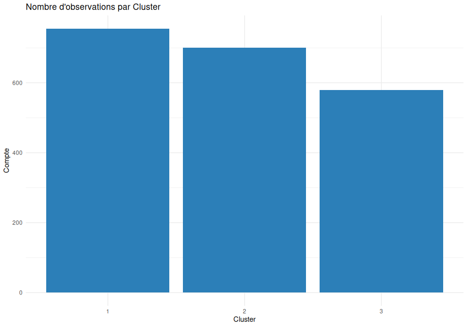
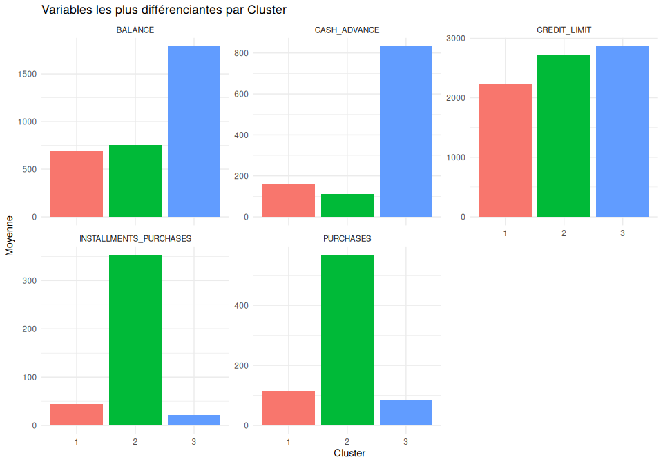
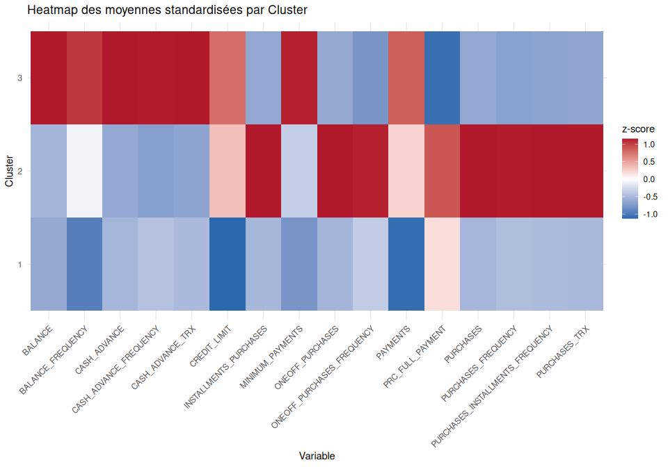

15_interpretation_profils
================

- [15. Interprétation des profils
  obtenus](#15-interprétation-des-profils-obtenus)
  - [15.1 Description des profils
    comportementaux](#151-description-des-profils-comportementaux)
  - [15.2 Analyse comparative des
    groupes](#152-analyse-comparative-des-groupes)
  - [15.3 Implications pratiques](#153-implications-pratiques)
  - [Annexe : Vue d’ensemble (Heatmap des moyennes
    standardisées)](#annexe--vue-densemble-heatmap-des-moyennes-standardisées)

## 15. Interprétation des profils obtenus

Ce document propose une lecture simple (niveau étudiant) des profils
issus du clustering, à partir des variables disponibles.

### 15.1 Description des profils comportementaux

``` r
# Chargement des librairies utiles
suppressMessages({
  library(dplyr)
  library(tidyr)
  library(ggplot2)
})

# Données préparées lors de l'étape de clustering
# (variables originales + colonne Cluster)
donnees <- read.csv("../../data/processed/clustered_data.csv")
donnees$Cluster <- as.factor(donnees$Cluster)

# Aperçu rapide
head(donnees)
```

    ##      BALANCE BALANCE_FREQUENCY PURCHASES ONEOFF_PURCHASES
    ## 1   40.90075          0.818182     95.40             0.00
    ## 2  817.71434          1.000000     16.00            16.00
    ## 3 1823.65274          1.000000    436.20             0.00
    ## 4 1014.92647          1.000000    861.49           661.49
    ## 5 2772.77273          1.000000      0.00             0.00
    ## 6  169.78168          1.000000    399.60             0.00
    ##   INSTALLMENTS_PURCHASES CASH_ADVANCE PURCHASES_FREQUENCY
    ## 1                   95.4       0.0000            0.166667
    ## 2                    0.0       0.0000            0.083333
    ## 3                  436.2       0.0000            1.000000
    ## 4                  200.0       0.0000            0.333333
    ## 5                    0.0     346.8114            0.000000
    ## 6                  399.6       0.0000            1.000000
    ##   ONEOFF_PURCHASES_FREQUENCY PURCHASES_INSTALLMENTS_FREQUENCY
    ## 1                   0.000000                         0.083333
    ## 2                   0.083333                         0.000000
    ## 3                   0.000000                         1.000000
    ## 4                   0.083333                         0.250000
    ## 5                   0.000000                         0.000000
    ## 6                   0.000000                         1.000000
    ##   CASH_ADVANCE_FREQUENCY CASH_ADVANCE_TRX PURCHASES_TRX CREDIT_LIMIT PAYMENTS
    ## 1               0.000000                0             2         1000 201.8021
    ## 2               0.000000                0             1         1200 678.3348
    ## 3               0.000000                0            12         2300 679.0651
    ## 4               0.000000                0             5         7000 688.2786
    ## 5               0.083333                1             0         3000 805.6480
    ## 6               0.000000                0            12         3000 215.3061
    ##   MINIMUM_PAYMENTS PRC_FULL_PAYMENT Cluster
    ## 1         139.5098                0       1
    ## 2         244.7912                0       1
    ## 3         532.0340                0       2
    ## 4         311.9634                0       2
    ## 5         989.9629                0       3
    ## 6         163.0055                0       2

``` r
# Résumé simple par groupe : moyenne des variables numériques par cluster
resume <- donnees %>%
  group_by(Cluster) %>%
  summarise(across(where(is.numeric), ~ mean(.x, na.rm = TRUE)), .groups = "drop")
resume
```

    ## # A tibble: 3 × 17
    ##   Cluster BALANCE BALANCE_FREQUENCY PURCHASES ONEOFF_PURCHASES
    ##   <fct>     <dbl>             <dbl>     <dbl>            <dbl>
    ## 1 1          691.             0.950     114.              69.9
    ## 2 2          752.             0.970     568.             215. 
    ## 3 3         1789.             0.994      83.8             62.2
    ## # ℹ 12 more variables: INSTALLMENTS_PURCHASES <dbl>, CASH_ADVANCE <dbl>,
    ## #   PURCHASES_FREQUENCY <dbl>, ONEOFF_PURCHASES_FREQUENCY <dbl>,
    ## #   PURCHASES_INSTALLMENTS_FREQUENCY <dbl>, CASH_ADVANCE_FREQUENCY <dbl>,
    ## #   CASH_ADVANCE_TRX <dbl>, PURCHASES_TRX <dbl>, CREDIT_LIMIT <dbl>,
    ## #   PAYMENTS <dbl>, MINIMUM_PAYMENTS <dbl>, PRC_FULL_PAYMENT <dbl>

``` r
# Graphique 1 : Taille des groupes (barres)
ggplot(donnees, aes(x = as.factor(Cluster))) +
  geom_bar(fill = "#2C7FB8") +
  labs(title = "Nombre d'observations par Cluster", x = "Cluster", y = "Compte") +
  theme_minimal()
```

<!-- -->

Lecture du graphique: - Chaque barre montre combien d’observations
appartiennent à un `Cluster`. - Des groupes trop petits peuvent être
moins stables; des groupes très grands peuvent être trop hétérogènes.

- Interprétez chaque `Cluster` en repérant les valeurs moyennes les plus
  élevées/faibles sur les variables clés (exemples: limite de crédit,
  solde moyen, fréquence de paiement, etc.).
- Donnez un nom simple à chaque profil (ex.: “Clients prudents”, “Gros
  utilisateurs”, “Équilibrés”).

### 15.2 Analyse comparative des groupes

``` r
# Taille de chaque groupe
compte <- donnees %>% count(Cluster)
compte
```

    ##   Cluster   n
    ## 1       1 755
    ## 2       2 700
    ## 3       3 580

``` r
# Variables qui différencient le plus les groupes (écart max des moyennes)
variances <- donnees %>%
  group_by(Cluster) %>%
  summarise(across(where(is.numeric), ~ mean(.x, na.rm = TRUE))) %>%
  pivot_longer(-Cluster, names_to = "variable", values_to = "moyenne") %>%
  group_by(variable) %>%
  summarise(ecart_max = max(moyenne) - min(moyenne)) %>%
  arrange(desc(ecart_max))
head(variances, 5)
```

    ## # A tibble: 5 × 2
    ##   variable               ecart_max
    ##   <chr>                      <dbl>
    ## 1 BALANCE                    1098.
    ## 2 CASH_ADVANCE                719.
    ## 3 CREDIT_LIMIT                631.
    ## 4 PURCHASES                   484.
    ## 5 INSTALLMENTS_PURCHASES      331.

``` r
# On prend les 5 variables les plus différenciantes
top_vars <- variances$variable[1:min(5, nrow(variances))]

# Préparation des moyennes par cluster pour ces variables
resume_long <- resume %>%
  pivot_longer(cols = -Cluster, names_to = "variable", values_to = "moyenne") %>%
  filter(variable %in% top_vars)

# Graphique 2 : Comparaison des moyennes par variable et par cluster (facettes)
ggplot(resume_long, aes(x = as.factor(Cluster), y = moyenne, fill = as.factor(Cluster))) +
  geom_col(show.legend = FALSE) +
  facet_wrap(~ variable, scales = "free_y") +
  labs(title = "Variables les plus différenciantes par Cluster",
       x = "Cluster", y = "Moyenne") +
  theme_minimal()
```

<!-- -->

Lecture du graphique: - Pour chaque variable (une facette), comparez la
hauteur des barres. - Les barres plus hautes indiquent des valeurs
moyennes plus élevées dans ce `Cluster`. - Repérez les variables où
l’écart entre groupes est le plus marqué pour décrire les profils.

- Comparez les groupes sur les 3 à 5 variables les plus différenciantes.
- Expliquez en une phrase la spécificité de chaque groupe par rapport
  aux autres.

### 15.3 Implications pratiques

- Proposez une action par profil (ex.: offre de fidélité pour les gros
  utilisateurs, accompagnement budgétaire pour les clients à solde
  élevé).
- Suggérez comment ces profils peuvent aider à mieux cibler la
  communication ou les produits.
- Mentionnez une limite: les profils évoluent, il faut les réévaluer
  régulièrement.

### Annexe : Vue d’ensemble (Heatmap des moyennes standardisées)

``` r
# Standardisation des moyennes pour visualiser toutes les variables sur une échelle comparable
resume_scaled <- resume
num_cols <- sapply(resume_scaled, is.numeric)
resume_scaled[num_cols] <- scale(resume_scaled[num_cols])

heatmap_long <- resume_scaled %>%
  pivot_longer(cols = where(is.numeric), names_to = "variable", values_to = "zscore")

ggplot(heatmap_long, aes(x = variable, y = as.factor(Cluster), fill = zscore)) +
  geom_tile() +
  scale_fill_gradient2(low = "#2166AC", mid = "#FFFFFF", high = "#B2182B") +
  labs(title = "Heatmap des moyennes standardisées par Cluster",
       x = "Variable", y = "Cluster", fill = "z-score") +
  theme_minimal() +
  theme(axis.text.x = element_text(angle = 45, hjust = 1))
```

<!-- -->

Lecture du graphique: - Couleurs rouges: au-dessus de la moyenne
(z-score positif); bleues: en dessous. - Lignes (clusters) avec
plusieurs cases rouges indiquent des profils “forts” sur ces
variables. - Utilisez cette vue pour nommer simplement les profils (ex.:
“Gros utilisateurs” si beaucoup de variables d’usage sont en rouge).
